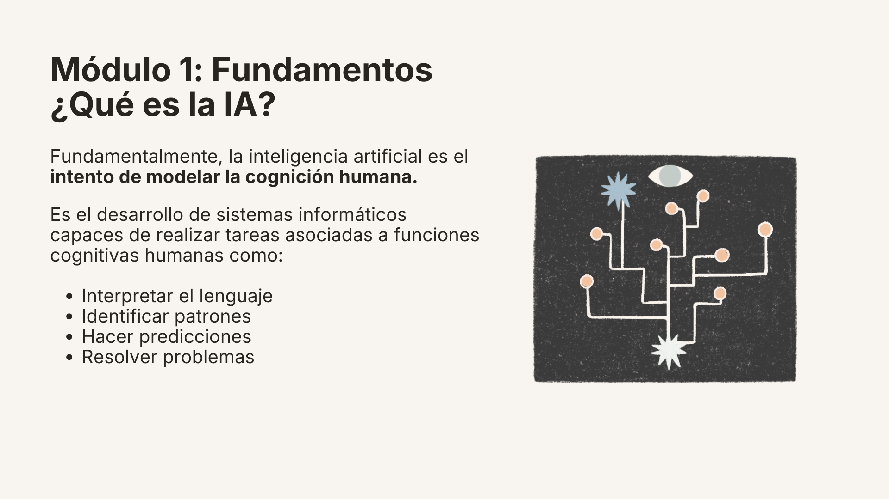
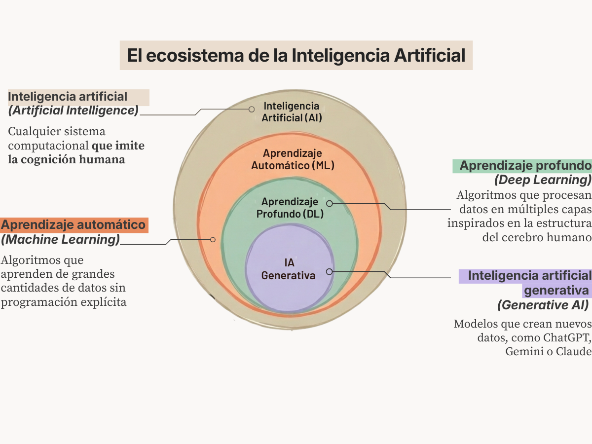
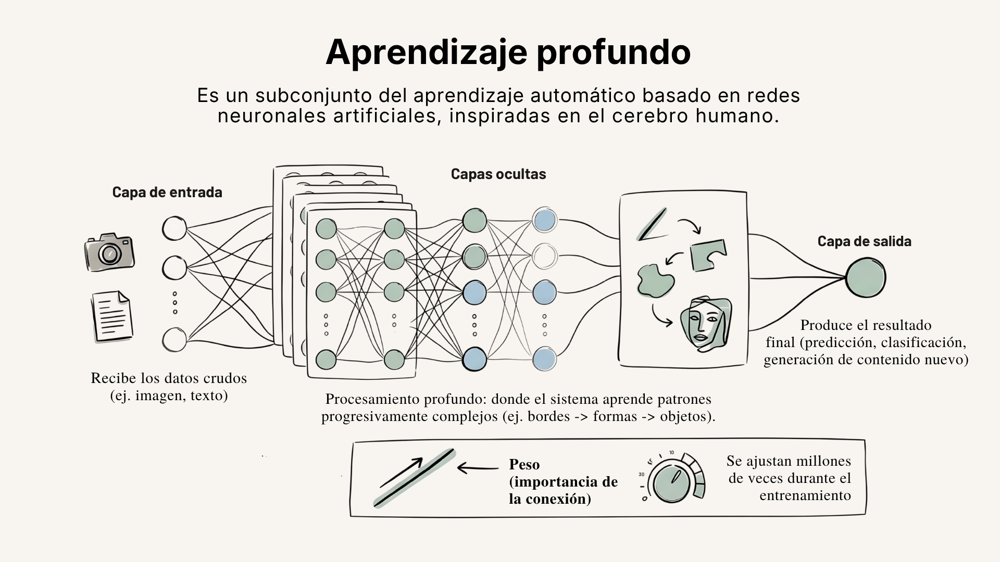
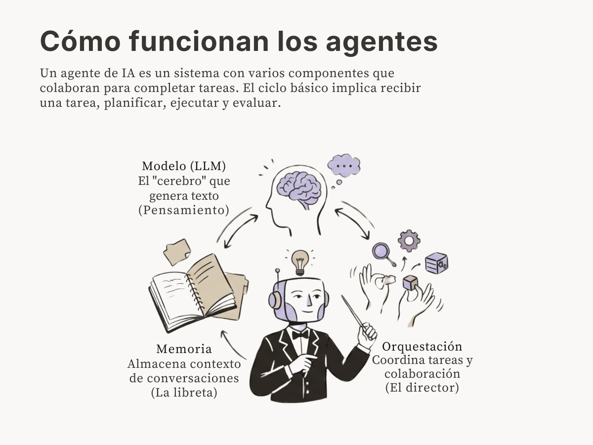

# Descifrando la Inteligencia Artificial: conceptos básicos

En este módulo, podrás entender qué es la Inteligencia Artificial, cómo funcionan las tecnologías detrás de ellas y profundizar sobre los modelos de lenguaje y otros conceptos clave que es necesario entender cuando usamos herramientas de IA. El principal objetivo es entender que la IA no es magia, es un conjunto de tecnologías que funcionan con matemáticas y modelos estadísticos que todas y todos tenemos la capacidad de entender. 

## ¿Qué es la Inteligencia Artificial?

Hoy, usamos tecnologías de Inteligencia Artificial (IA) todos los días. Las redes sociales (TikTok, Instagram, Facebook) usan algoritmos de IA para decidir qué contenido mostrar. Netflix y Spotify aprenden de las series y películas que vemos.[^2] Google Maps predice tráfico con datos de millones de teléfonos.[^3] Los filtros de Snapchat e Instagram usan visión por computadora para identificar los rasgos faciales en tiempo real, lo que les permite aplicar con precisión máscaras y efectos digitales en tu rostro. [^3] 

La inteligencia artificial es el desarrollo de sistemas informáticos capaces de realizar tareas asociadas a funciones cognitivas humanas: interpretar el habla, identificar patrones, hacer predicciones y resolver problemas.[^1] Se compone de varias tecnologías, como el aprendizaje de máquina (Machine Learning) y el aprendizaje profundo (Deep Learning), que permiten a las computadoras aprender de datos y hacer predicciones o tomar decisiones basadas en ellos.

## ¿Cómo Funciona el Aprendizaje de Máquina? (Machine Learning)

El aprendizaje automático es la principal tecnología detrás de lo que conocemos como Inteligencia Artificial. En realidad es una rama de las ciencias de la computación que busca desarrollar algoritmos que aprenden de datos sin programación explícita [^5]. Para que este proceso ocurra, necesitamos combinar varios elementos clave:
#### Datos (la materia prima)
Un modelo de aprendizaje automático necesita miles o millones de ejemplos para aprender. [^6] Para entrenar un modelo de aprendizaje supervisado que aprenda a reconocer gatos, se necesitan miles de fotos de gatos. Aquí es importante preguntarnos, ¿quién genera estos datos? ¿quién los sistematiza? ¿qué historias se cuentan a partir de ellos? 

???+ tip "Escucha: Datos y políticas públicas"
    Si quieres saber más sobre la importancia de los datos y su impacto en la toma de decisiones, escucha el episodio de Hijas de Internet con @tacosdedatos sobre la datos y políticas públicas.

    <iframe src="https://creators.spotify.com/pod/profile/hijas-de-internet/embed/episodes/T3-EP-6--Datos-y-polticas-pblicas-e1alhpe/a-a6uv6rb" height="102px" width="400px" frameborder="0" scrolling="no"></iframe>

#### Algoritmos (la receta)
Un algoritmo es un conjunto de reglas matemáticas que le dice al modelo cómo procesar datos y encontrar patrones [^7]. En la programación tradicional, los humanos escribimos instrucciones explícitas (si pasa A, haz B). El aprendizaje automático cambia esto: en lugar de darle las reglas a la computadora, le damos datos y dejamos que los algoritmos descubran los patrones por sí mismos para realizar predicciones o tomar decisiones sin ser programado para cada escenario específico.[^8]

Existen distintos tipos de algoritmos de aprendizaje, y la elección depende de la tarea y los datos disponibles:

- **Supervisado:** El modelo aprende de datos etiquetados de ejemplos donde ya conocemos la respuesta correcta.[^9] Por ejemplo, miles de fotos ya clasificadas como "gato" o "perro". El modelo aprende a asociar las características de la imagen con la etiqueta correcta.
- **No supervisado:** El modelo encuentra patrones sin etiquetas.[^10] Aquí el algoritmo descubre por sí mismo agrupaciones o estructuras en los datos. Por ejemplo, los sistemas de recomendación que sugerir productos, películas o música mediante el análisis del comportamiento de los usuarios.
- **Por refuerzo:** El modelo aprende por prueba y error, recibiendo recompensas cuando acierta y penalizaciones cuando se equivoca.[^11] Así se entrenó [AlphaGo](https://es.wikipedia.org/wiki/AlphaGo) para jugar Go.
#### Entrenamiento (la práctica)
Así como una persona aprende con la práctica, un modelo prueba una y otra vez con los datos, ajustándose cuando se equivoca. [^12] Es como estudiar para un examen con tarjetas didácticas, pero haciendo millones de repeticiones. Durante el entrenamiento, el modelo ajusta millones de parámetros internos (llamados "pesos") hasta minimizar sus errores. El tipo de entrenamiento depende del algoritmo: en el supervisado, el modelo compara sus predicciones con las respuestas correctas; en el no supervisado, busca patrones y agrupaciones; en el de refuerzo, optimiza una función de recompensa.

#### Validación (el examen)
Una vez entrenado, el modelo se prueba con datos que nunca ha visto antes para verificar si realmente aprendió patrones generalizables o solo memorizó los ejemplos de entrenamiento. [^13] Un modelo que solo memoriza (lo que se llama [sobreajuste](https://es.wikipedia.org/wiki/Sobreajuste) u *overfitting*) puede tener un rendimiento perfecto con sus datos de entrenamiento pero fallar con datos nuevos. La validación funciona como un examen sorpresa, si el modelo realmente aprendió, puede responder preguntas que nunca ha visto antes.
#### Fine-tuning (la especialización)
Un modelo pre-entrenado tiene conocimiento general, pero no necesariamente hace bien una tarea específica. El *fine-tuning* (o refinamiento) es el proceso de tomar ese modelo general y adaptarlo con datos especializados, sin tener que entrenarlo desde cero [^14].  Por ejemplo, un modelo de visión por computadora entrenado para reconocer objetos generales puede refinarse con imágenes médicas para detectar tumores. Un modelo de texto general puede refinarse con documentos legales para asistir abogados. En lugar de construir un modelo desde cero para cada tarea, lo que requeriría millones de datos y mucho cómputo, el fine-tuning permite reutilizar el conocimiento previo y especializarlo con menos recursos.
#### Inferencia (la aplicación)
Cuando el modelo ya entrenado aplica lo aprendido a datos nuevos. Cada vez que un modelo de IA clasifica una imagen, traduce un texto o genera una respuesta, está haciendo *inferencia*n No está aprendiendo nada nuevo, está usando lo que ya aprendió [^15].  

## ¿Cómo Funciona el Aprendizaje Profundo? (Deep Learning)

El aprendizaje profundo es un subconjunto del aprendizaje automático (_Machine Learning_) que se basa en redes neuronales artificiales.[^16] Estas redes están inspiradas en cómo funcionan las neuronas del cerebro humano, representadas por nodos y conexiones entre ellos. [^18]

La palabra "profundo" significa que tiene muchas capas ocultas (decenas, cientos o miles). Cada capa transforma los datos un poco más, descubriendo patrones cada vez más complejos.[^18] En la práctica, una red neuronal está organizada en tres tipos de capas:

1. **Capa de entrada:** Recibe los datos crudos (una imagen, un texto convertido en números, una tabla de datos)
2. **Capas ocultas:** Aquí ocurre el procesamiento. Cada capa aprende patrones progresivamente más complejos. Por ejemplo, en reconocimiento de imágenes: la primera capa detecta bordes y líneas, la siguiente reconoce formas geométricas, las más profundas identifican objetos completos como un rostro o un auto.[^18]
3. **Capa de salida:** Produce el resultado final (una predicción, una clasificación, un texto generado)

Cada conexión entre neuronas tiene un peso, un número que indica qué tan importante es esa conexión. Durante el entrenamiento, estos pesos se ajustan millones de veces hasta que la red aprende a dar respuestas correctas.[^18]

??? info "Profundiza: el ciclo de entrenamiento paso a paso"
    A diferencia de la programación tradicional, donde una persona escribe reglas fijas, en el aprendizaje profundo la máquina descubre sus propias reglas. Lo hace repitiendo un ciclo de tres pasos:

    1. **Propagación hacia adelante (*Forward Propagation*):** Los datos entran por la capa de entrada y viajan hacia adelante, capa por capa, hasta producir una respuesta en la salida.[^17]
    2. **Cálculo del error:** El sistema compara su respuesta con la correcta y calcula qué tan equivocado está usando una "función de pérdida", básicamente, una medida numérica de su error.[^19]
    3. **Retropropagación (*Backpropagation*):** El error se envía de regreso por la red para ajustar los pesos de las conexiones. Las conexiones que contribuyeron al error se debilitan; las que habrían dado la respuesta correcta se refuerzan.[^20]

    Este ciclo se repite millones de veces. Con cada repetición la red minimiza sus errores, hasta que es capaz de hacer predicciones precisas con datos que nunca ha visto.

## ¿Qué es la Inteligencia Artificial Generativa? (Generative AI)

Durante la mayor parte de la década pasada, el enfoque del aprendizaje profundo estuvo en la clasificación y predicción. Estos modelos aprenden la frontera de decisión entre categorías (ej. "esto es un perro" vs. "esto es un gato") basándose en características de los datos de entrenamiento. Se les llama modelos *discriminativos* porque su tarea es distinguir, es decir, responden a la pregunta "¿qué es esto?". Son los que están detrás de aplicaciones como filtros de spam, detección de fraudes bancarios, diagnóstico médico por imagen y análisis de sentimientos en redes sociales [^21].

Los modelos *generativos* hacen algo fundamentalmente distinto, en lugar de aprender solo las fronteras entre categorías, aprenden la distribución completa de los datos, es decir, las reglas estadísticas de cómo se estructura la información [^21]. Esto les permite crear contenido nuevo que se asemeja a lo que vieron durante el entrenamiento: texto, imágenes, audio, video.

??? example "Comparación: modelos discriminativos vs generativos"
    |               | Discriminativos                                           | Generativos                         |
    | ------------- | --------------------------------------------------------- | ----------------------------------- |
    | **Qué hacen** | Clasifican o distinguen entre categorías                  | Crean contenido nuevo               |
    | **Pregunta**  | "¿Qué es esto?"                                           | "¿Cómo sería algo como esto?"       |
    | **Cómo aprenden** | Fronteras de decisión entre clases (aprendizaje supervisado) | Distribuciones completas de datos (auto-supervisado o no supervisado) [^21] |
    | **Ejemplos**  | Filtro de spam, reconocimiento facial, diagnóstico médico | ChatGPT, DALL-E, Midjourney, Suno   |
    | **Ventaja**   | Más rápidos de entrenar, más fáciles de interpretar [^21] | Pueden crear contenido original y manejar datos limitados [^21] |
    | **Limitación** | No pueden generar nada nuevo                             | Costosos computacionalmente, pueden generar contenido sesgado [^21] |

En 2017, un equipo de Google publicó "Attention Is All You Need", el paper que introdujo la arquitectura Transformer.[^22] Los modelos anteriores (llamados redes recurrentes) procesaban texto palabra por palabra, en secuencia. El Transformer cambió esto con un mecanismo de "atención" que permite al modelo enfocarse en las partes más relevantes de todo el texto de entrada simultáneamente, procesando secuencias completas en paralelo.[^31] Esto hizo que los modelos fueran mucho más rápidos de entrenar y permitió que los modelos crecieran exponencialmente.[^22]

El resultado: en noviembre de 2022, OpenAI lanzó ChatGPT, un modelo basado en TransformerS, al público y alcanzó 100 millones de usuarios en solo dos meses, un récord histórico de adopción tecnológica.[^23]
## ¿Cómo Funcionan los Modelos de Lenguaje de Gran Tamaño?

Los modelos de de lenguaje de gran tamaño son modelos de inteligencia artificial generativa que son entrenados con enormes cantidades de texto, lo que les permite procesar y generar lenguaje natural[^24]. Cuando escribes algo, el modelo calcula la distribución de probabilidad para el siguiente **token** (que puede ser una palabra o parte de ella) basándose en todo el contexto previo. **No "entienden" lo que dicen**, predicen palabras basándose en patrones estadísticos.
### Cotorros estocásticos (Stochastic Parrots)

Este término fue acuñado por las investigadoras Emily Bender y Timnit Gebru (2021) [^25]. La metáfora sugiere que estos modelos son como loros sofisticados que combinan patrones de lenguaje sin comprender su significado.

!!! warning "Implicaciones"
    - Pueden generar texto convincente pero completamente falso (**alucinaciones**)
    - Pueden reproducir los sesgos de sus datos de entrenamiento
    - Fueron entrenados principalmente con texto de Internet en inglés, de sitios web creados mayoritariamente por hombres, blancos, del Norte Global

??? example "Sobre Timnit Gebru y el paper que sacudió a Google"
    Investigadora eritreo-etíope-estadounidense en ética de la IA. En diciembre de 2020, su empleo en Google terminó por el paper "On the Dangers of Stochastic Parrots". Aproximadamente 2,700 empleados firmaron una carta de protesta. Es cofundadora de Black in AI y fundadora del [Distributed Artificial Intelligence Research Institute (DAIR)](https://www.dair-institute.org/). Su caso es emblemático sobre el poder de las grandes empresas tecnológicas sobre la investigación crítica.[^26]

### Alineación 

Un modelo de lenguaje entrenado con texto de Internet puede predecir palabras, pero no necesariamente tiene los resultados deseados ni se alinea con valores humanos. Para cerrar esa brecha se utilizan técnicas de alineación:

???+ info "¿Cómo se alinean los LLMs? SFT, RLHF y Constitutional AI"
    **Fine-tuning supervisado (SFT):** Consiste en tomar un modelo de lenguaje preentrenado y seguir entrenándolo con un conjunto de datos más pequeño y específico para una tarea, con ejemplos etiquetados para que funcione mejor en la tarea específica sin perder los conocimientos generales adquiridos durante el preentrenamiento. [^27].

    **RLHF (Reinforcement Learning from Human Feedback):** Evaluadores humanos comparan pares de respuestas del modelo y eligen cuál es mejor. Con esas comparaciones se entrena un "modelo de recompensa" que aprende a predecir qué respuestas prefieren los humanos. El modelo se optimiza para maximizar esas recompensas [^28].

    **Constitutional AI (Anthropic, 2022):** En lugar de depender exclusivamente de evaluadores humanos, el modelo se entrena usando un conjunto de principios escritos (una "constitución"). El modelo genera respuestas, se autocritica según esos principios, y se revisa a sí mismo.[^29]

## IA Agéntica (Agentic AI)

Sistemas de IA que actúan de manera autónoma para lograr objetivos específicos, realizando múltiples acciones en secuencia sin intervención humana constante [^30]. La principal diferencia con ChatGPT y otros chatbots es que estas aplicaciones responden a prompts individuales, mientras que un agente de IA puede planear, ejecutar tareas complejas y adaptarse según los resultados.

**Ejemplo:** En lugar de pedir "escríbeme un análisis de mercado" y recibir una respuesta, un agente podría buscar datos en internet, organizarlos, hacer el análisis, crear visualizaciones y escribir un reporte completo.

!!! danger "Advertencia"
    Los agentes de IA requieren supervisión humana. No son todavía lo suficientemente confiables para tareas críticas sin supervisión. Deben usarse para aumentar la productividad, no para reemplazar el criterio humano. **Nunca compartas contraseñas, información bancaria o datos sensibles con estos sistemas.**

## De entender la IA a cuestionar sus impactos

La IA tiene más de 70 años de historia. A lo largo de ese camino hubo "inviernos", periodos donde se prometió demasiado y la tecnología no cumplió. Ese patrón se repite hoy, la IA generativa y agéntica genera enormes expectativas, pero también riesgos reales que es importante entender.

Lo que habilitó la IA moderna fue una combinación de tres factores: más datos disponibles, más poder de cómputo (GPUs) y mejores algoritmos (especialmente los Transformers). Pero entender *cómo* funciona la IA es solo el primer paso. Las preguntas más importantes son: **¿para quién funciona? ¿a quién deja fuera? ¿qué sesgos reproduce?**

Los modelos de IA aprenden de datos que reflejan las desigualdades del mundo real. Si un modelo se entrena con datos que sobrerrepresentan a ciertos grupos y subrrepresentan a otros, sus predicciones reproducirán esas mismas desigualdades. En el siguiente módulo exploraremos los **sesgos algorítmicos**: cómo se originan, cómo afectan a comunidades en América Latina, y qué podemos hacer al respecto.

!!! info "Lo que viene"
    **Módulo 2: Sesgos algorítmicos**. ¿Qué pasa cuando la IA discrimina? Casos reales, desde reconocimiento facial hasta sistemas de justicia, y herramientas para identificar y cuestionar estos sesgos.
    
??? abstract "Glosario de conceptos clave"
    | Concepto                     | Definición breve                                                                                                                                                                       |
    | ---------------------------- | -------------------------------------------------------------------------------------------------------------------------------------------------------------------------------------- |
    | Inteligencia Artificial (IA) | Sistemas informáticos que realizan tareas cognitivas: interpretar habla, identificar patrones, hacer predicciones                                                                      |
    | Machine Learning (ML)        | Algoritmos que aprenden de datos sin ser programados explícitamente                                                                                                                    |
    | Deep Learning                | Redes neuronales con múltiples capas. Son "profundos" porque contienen muchas capas, no porque son "más inteligentes"                                                                  |
    | Red neuronal                 | Modelo computacional inspirado en las neuronas del cerebro, organizado en capas de entrada, ocultas y de salida                                                                        |
    | Datos de entrenamiento       | El conjunto de ejemplos que un modelo usa para aprender patrones. Su calidad y representatividad determinan el comportamiento del modelo                                                |
    | Fine-tuning                  | Tomar un modelo preentrenado y adaptarlo con datos especializados para una tarea específica, sin entrenarlo desde cero                                                                 |
    | LLM (Large Language Model)   | Modelos de lenguaje generativos que predicen la siguiente palabra más probable                                                                                                         |
    | Transformer                  | Arquitectura de red neuronal con mecanismo de "atención" que procesa secuencias completas en paralelo (Google, 2017)                                                                   |
    | Inferencia                   | Cuando un modelo ya entrenado aplica lo aprendido a datos nuevos                                                                                                                       |
    | Tokenización                 | Los LLMs nunca "ven" texto directamente. El texto se divide en "tokens", fragmentos de texto que se convierten en números. Un token equivale a aproximadamente 4 caracteres en inglés. |
    | IA generativa                | IA que crea contenido nuevo (texto, imagen, audio, video)                                                                                                                              |
    | IA discriminativa            | IA que clasifica o distingue entre categorías                                                                                                                                          |
    | Alineación (RLHF)           | Técnicas para que los modelos respondan de forma útil y segura, usando retroalimentación humana o principios escritos                                                                   |
    | Alucinaciones                | Cuando un modelo genera texto convincente pero factualmente incorrecto, porque predice palabras probables, no verifica hechos                                                          |
    | IA agéntica (Agentic AI)     | Sistemas de IA que actúan de forma autónoma para lograr objetivos, ejecutando múltiples acciones en secuencia                                                                          |
    | Temperatura                  | Controla la aleatoriedad de las respuestas. Baja = respuestas predecibles. Alta = respuestas diversas pero potencialmente incoherentes.                                                |
    | Ventana de contexto          | La cantidad máxima de texto que un LLM puede procesar en una interacción. Si la conversación excede la ventana, el modelo "olvida".                                                    |

??? tip "Recursos para seguir aprendiendo"
    - **Teachable Machine (Google):** https://teachablemachine.withgoogle.com/ — Entrena tu primer modelo de IA sin código
    - **Google Quick, Draw!:** https://quickdraw.withgoogle.com/ — Dibuja y ve cómo una IA adivina qué es
    - **Embedding Visualization:** https://helboukkouri.github.io/embedding-visualization/ — Ve cómo la IA representa palabras como números
    - **Elements of AI (en español):** https://www.elementsofai.com/es/
    - **Google AI - Intro al ML (español):** https://cloud.google.com/learn/training/machinelearning-ai?hl=es
    - **Fast.ai:** https://www.fast.ai/
    - **Anthropic Courses:** https://anthropic.skilljar.com/
    - https://www.skills.google/
    - https://notebooklm.google.com/
    - https://www.youtube.com/@googlecloudtech

---

## Referencias

[^1]: Google Cloud. Artificial intelligence (AI): a simple-to-understand guide. [https://hai.stanford.edu/assets/files/hai_ai-index-report-2024-smaller2.pdf](https://cloud.google.com/learn/what-is-artificial-intelligence?hl=en)
[^2]: Boston Institute of Analytics. How Machine Learning Powers Recommendation Systems (Netflix, Amazon, Spotify). <https://bostoninstituteofanalytics.org/blog/how-machine-learning-powers-recommendation-systems-netflix-amazon-spotify/#:~:text=Machine%20Learning%20provides%20recommendation%20systems,provides%20the%20most%20tailored%20recommendations>.
[^3]: Google. Google Maps 101: How AI helps predict traffic and determine routes. <https://blog.google/products-and-platforms/products/maps/google-maps-101-how-ai-helps-predict-traffic-and-determine-routes/#:~:text=To%20predict%20what%20traffic%20will,Sydney%2C%20Tokyo%2C%20and%20Washington%20D.C.>
[^4]: ScienceABC. How Do Snapchat And Instagram Filters Work?. <https://www.scienceabc.com/innovation/how-do-snapchat-and-instagram-filters-work.html#:~:text=The%20computer%20converts%20the%20image,your%20face%20to%20one%20side.>
[^5]: IBM. ¿Qué es el aprendizaje automático?. <https://www.ibm.com/mx-es/think/topics/machine-learning>
[^6]: DataRobot. The importance of machine learning data. <https://www.datarobot.com/blog/the-importance-of-machine-learning-data/#:~:text=What%20type%20of%20data%20does,series%20data%2C%20and%20text%20data.>
[^7]: DataCamp. *What Is an Algorithm?*. <https://www.datacamp.com/blog/what-is-an-algorithm>
[^8]: GeeksforGeeks. Traditional Programming vs Machine Learning. <https://www.geeksforgeeks.org/machine-learning/traditional-programming-vs-machine-learning/>
[^9]: Google for Developers. *Supervised Learning*. <https://developers.google.com/machine-learning/intro-to-ml/supervised>
[^10]: GeeksforGeeks. *What is Unsupervised Learning*. <https://developers.google.com/machine-learning/intro-to-ml/supervised>
[^11]: IBM. Qué es el aprendizaje por refuerzo. <https://www.ibm.com/mx-es/think/topics/reinforcement-learning>
[^12]: IBM. ¿Qué es el entrenamiento de modelos?. <https://www.ibm.com/mx-es/think/topics/model-training>
[^13]: GeeksforGeeks. *What is Model Validation and Why is it Important?*. <https://www.geeksforgeeks.org/machine-learning/what-is-model-validation-and-why-is-it-important/>
[^14]: IBM. ¿Qué es el refinamiento?. <https://www.ibm.com/mx-es/think/topics/fine-tuning>
[^15]: Google Cloud. ¿Qué es la inferencia de IA?. <https://cloud.google.com/discover/what-is-ai-inference?hl=es-419>
[^16]: IBM. El modelo de redes neuronales. <https://www.ibm.com/docs/es/spss-modeler/saas?topic=networks-neural-model>
[^17]: DataCamp. Propagación hacia delante en redes neuronales: Guía completa. <https://www.datacamp.com/es/tutorial/forward-propagation-neural-networks>
[^18]: IBM. ¿Qué es el aprendizaje profundo?. <https://www.ibm.com/mx-es/think/topics/deep-learning>
[^19]: DataCamp. Explicación de las funciones de pérdida en el machine learning. <https://www.datacamp.com/es/tutorial/loss-function-in-machine-learning>
[^20]: IBM. ¿Qué es la retropropagación?. <https://www.ibm.com/mx-es/think/topics/backpropagation>
[^21]: GeeksforGeeks. Generative AI vs Discriminative AI. Artículo divulgativo. <https://www.geeksforgeeks.org/artificial-intelligence/generative-ai-vs-discriminative-ai/>
[^22]: Vaswani et al. (2017). "*Attention Is All You Need*". <https://arxiv.org/abs/1706.03762>
[^23]: Capgemini. "*A Chorus of Disruption: From Cave Paintings to Large Language Models*". <https://www.capgemini.com/mx-es/insights/expert-perspectives/auditing-chatgpt-part-i/#:~:text=The%20technological%20history%20of%20the,launched%20the%20era%20of%20LLMs.>
[^24]: IBM. ¿Qué son los grandes modelos de lenguaje (LLM)?. <https://www.ibm.com/mx-es/think/topics/large-language-models>
[^25]: Bender & Gebru (2021). "*On the Dangers of Stochastic Parrots.*" <https://dl.acm.org/doi/10.1145/3442188.3445922>
[^26]: MIT Technology Review. "*We read the paper that forced Timnit Gebru out of Google. Here’s what it says.*" <https://www.technologyreview.com/2020/12/04/1013294/google-ai-ethics-research-paper-forced-out-timnit-gebru/>
[^27]: GeeksforGeeks. "*Supervised Fine-Tuning (SFT) for LLMs.*" <https://www.geeksforgeeks.org/artificial-intelligence/supervised-fine-tuning-sft-for-llms/>
[^28]: Sandgarden. "#*Teaching AI to Play Nice: The Art and Science of LLM Alignment.*" <https://www.sandgarden.com/learn/llm-alignment>
[^29]: Bai et al. (2022). "*Constitutional AI: Harmlessness from AI Feedback*". <https://arxiv.org/abs/2212.08073>
[^30]: Google Cloud. "*What is an AI agent*?. <https://cloud.google.com/discover/what-are-ai-agents?hl=en>
[^31]: Jay Alammar. "*The Illustrated Transformer*. <https://jalammar.github.io/illustrated-transformer/#:~:text=As%20the%20model%20processes%20each,one%20we're%20currently%20processing.>
