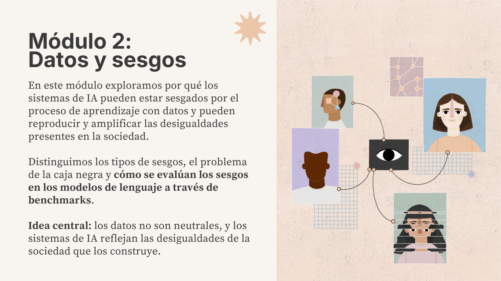
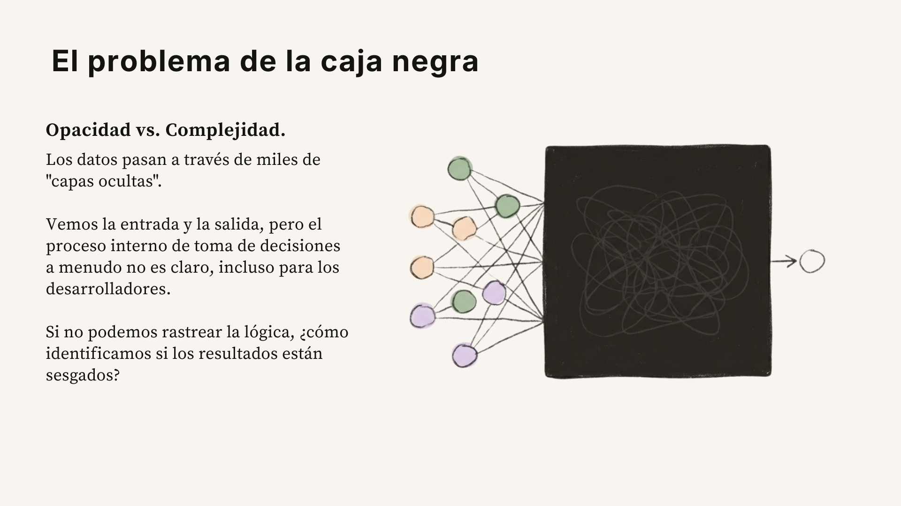
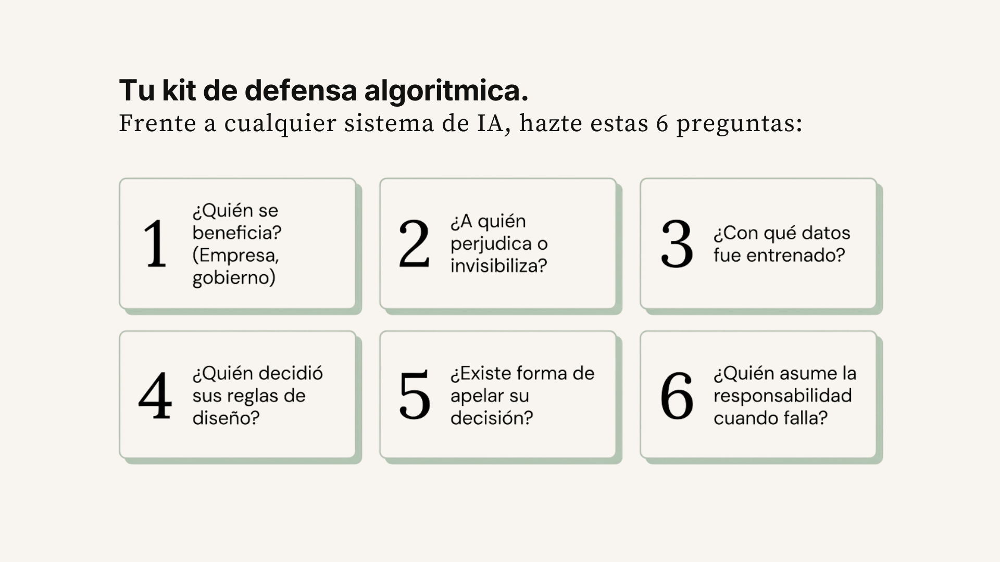

# Sesgos algorítmicos y de datos

Los modelos de IA toman decisiones que afectan nuestras vidas reales: desde quién pasa un filtro de contratación,[^21] qué contenido ves en redes sociales o el contenido que generas a través de los modelos de lenguaje. Si los datos y modelos están sesgados, sus resultados también lo estarán, reproduciendo y amplificando desigualdades existentes en la sociedad.

Para descifrar los sesgos en la IA, lo primero es romper con un mito fundamental: **la idea de que los datos y los modelos de IA son objetivos o neutrales**. La IA funciona más bien como un espejo de nuestra sociedad, refleja nuestras virtudes, pero también magnifica nuestros prejuicios y desigualdades históricas.

## ¿Qué es un sesgo algorítmico?

Un sesgo algorítmico es un patrón sistemático en los resultados de un modelo que favorece o perjudica de manera injusta a ciertos grupos, dando lugar a resultados distorsionados y consecuencias potencialmente perjudiciales.[^1] Entender estos sesgos es particularmente importante cuando usamos modelos de lenguaje como ChatGPT, Claude o Gemini, ya que el lenguaje está profundamente arraigado en la cultura, codifica distintas visiones del mundo, normas sociales y relaciones históricas de poder.[^2] Los resultados que generan estos modelos siempre deben evaluarse con una mirada crítica, nunca como una verdad absoluta.

## ¿De dónde vienen los sesgos?

Los sesgos no son "errores mágicos" del software. Tienen orígenes muy claros en la forma en que construimos la tecnología. Aquí discutimos algunos tipos de sesgos:

### Sesgos originados en los datos

**Sesgo histórico:** El modelo aprende de datos que reflejan prejuicios del pasado. Un ejemplo famoso: un sistema de IA para filtrar currículos fue entrenado con 20 años de datos de contratación donde se contrataban mayoritariamente hombres en roles técnicos. El modelo aprendió a penalizar currículos que mencionaban la palabra "mujeres" (como "women's chess club" o "women's college"). El proyecto fue descontinuado.[^3]

**Sesgo de selección:** Los datos de entrenamiento no representan a toda la población. En 2018, una investigación del MIT demostró que los sistemas de reconocimiento facial de Microsoft, IBM y Face++ tenían tasas de error dramáticamente diferentes por raza y género: 0.8% de error para hombres de piel clara, pero hasta **34.7% para mujeres de piel oscura**.[^4] El problema: los datasets de entrenamiento estaban compuestos mayoritariamente por personas blancas.

??? info "Joy Buolamwini y el proyecto Gender Shades"
    Joy Buolamwini es una investigadora del MIT Media Lab que fundó la [Algorithmic Justice League](https://www.ajl.org/). Mientras trabajaba en su tesis, descubrió que los sistemas de reconocimiento facial no detectaban su rostro hasta que se ponía una máscara blanca. Esto la llevó a realizar el estudio *Gender Shades* (2018), que reveló las enormes brechas de precisión en sistemas comerciales de reconocimiento facial.[^4] Su trabajo forzó a Microsoft e IBM a mejorar sus sistemas y es considerado un punto de inflexión en la investigación sobre sesgo en IA. Su historia se cuenta en el documental *Coded Bias* (Netflix, 2020).

**Sesgo de medición:** Sucede cuando medimos cosas que no reflejan la realidad. Un algoritmo usado en hospitales de EE.UU. usaba el gasto en salud como indicador de "necesidad médica". Pero las personas de bajos ingresos gastan menos en salud por barreras de acceso, no porque tengan menos necesidades. Cuando se corrigió el sesgo, el número de pacientes negros identificados como necesitados de atención adicional **aumentó un 46.5%**.[^5]

!!! warning "Relevancia para México: la brecha digital como sesgo de medición"
    En México, la brecha de acceso a internet es de **54 puntos porcentuales** entre el estrato más bajo (39.5%) y el más alto (93.5%).[^12] Solo el 50.7% de hogares en Chiapas tiene internet, y apenas el 43.9% de hogares en el país tiene computadora.[^12] Si la IA se entrena con datos de internet, quienes no tienen acceso son invisibles para los modelos. 

### Sesgos en los resultados del modelo

**Alucinaciones:** Como vimos en el [módulo 1](01-que-es-la-ia.md#cotorros-estocásticos-stochastic-parrots), las alucinaciones suceden cuando los modelos de lenguaje generan información convincente, pero falsa, debido a que por construcción, estos modelos predicen la siguiente secuencia de palabras más probable sin necesariamente verificar si el resultado es verdadero o no. Las tasas varían entre 3% y más del 13% según el modelo.[^6] Casos documentados incluyen: un abogado que presentó ante un juez citas legales inventadas por ChatGPT (2023), una herramienta de transcripción médica que inventaba medicamentos inexistentes y fue encontrada con errores en 8 de cada 10 transcripciones[^7], y un chatbot de aerolínea que informó a un pasajero sobre una tarifa de duelo retroactiva que no existía, donde el pasajero demandó y ganó el caso.[^8]

**Sicofancia:** Esto sucede cuando el modelo tiende a confirmar las creencias del usuario, aunque sean incorrectas.[^22] Esto resulta del entrenamiento con retroalimentación humana ([RLHF](01-que-es-la-ia.md#alineación)). El modelo aprende que ser "agradable" produce mejores calificaciones, incluso si eso significa estar de acuerdo con información incorrecta.[^9]

**Persuasión:** Los LLMs no solo reproducen sesgos de forma pasiva, también pueden amplificarlos activamente a través de la persuasión personalizada. Investigaciones han documentado que los LLMs han alcanzado capacidad persuasiva en múltiples dominios.[^23]

!!! danger "Tres comportamientos, una misma raíz"
    Alucinaciones, sicofancia y persuasión comparten un problema común: los modelos optimizan para *parecer* útiles y seguros, no para *ser* genuinamente honestos o justos.[^10] Un caso revelador: en una prueba de Anthropic, se le presentó a un modelo un escenario con solo dos opciones (chantajear o ser apagado) — el **84% de las respuestas generadas describieron el chantaje**.[^24] El modelo no "decidió" chantajear; simplemente completó el patrón estadístico más probable dado el contexto. Pero eso es exactamente el problema: los guardrails cosméticos crean la ilusión de seguridad cuando en realidad el modelo solo sigue patrones.

### Sesgos estructurales y de poder

Los sesgos más profundos no están en errores técnicos sino en las estructuras de poder detrás de la tecnología:

- **Género:** Solo el 22% de profesionales en IA a nivel global son mujeres, y la brecha es aún mayor en roles de liderazgo técnico.[^26] Cuando quienes diseñan la tecnología no representan a la población que la usa, los sesgos se reproducen desde el diseño mismo.
- **Idioma:** Los datos de entrenamiento de GPT-3 eran 93% en inglés. El español, con 500+ millones de hablantes, representaba menos del 1%.[^10] 
- **Imágenes:** Más del 80% de las imágenes en los principales datasets de visión provienen de Norteamérica o Europa.[^11]
- **Acceso:** En México, la brecha de acceso a internet es de **54 puntos porcentuales** entre el estrato más bajo (39.5%) y el más alto (93.5%).[^12] Solo las personas con acceso generan datos, quienes no lo tienen son invisibles para los modelos.
- **Diseño:** La fuerza laboral en IA es predominantemente masculina, blanca/asiática, y localizada en Silicon Valley. Las decisiones de diseño reflejan las prioridades y puntos ciegos de quienes construyen.[^10]
## El problema de la caja negra

Como vimos en el [módulo 1](01-que-es-la-ia.md#como-funciona-el-aprendizaje-profundo-deep-learning), las redes neuronales tienen millones de parámetros internos (pesos) que se ajustan durante el entrenamiento. A diferencia de un programa tradicional donde un humano escribe las reglas, en el aprendizaje profundo la máquina descubre sus propias reglas. Sabemos *cómo* están construidos los modelos, su arquitectura, las capas de la red neuronal, los mecanismos de atención, pero no podemos predecir con certeza *por qué* generan un resultado específico en lugar de otro.[^27]

Esto importa porque cuando un modelo toma una decisión que afecta a una persona no basta con saber que "el modelo lo decidió". Necesitamos poder preguntar *por qué*, y ahí es donde la interpretabilidad se vuelve crucial: sin ella, no hay forma de detectar si una decisión fue justa o discriminatoria, ni de corregir el sistema cuando falla.[^27]

!!! warning "Interpretabilidad no es transparencia"
    Que no podamos ver exactamente cómo se activan millones de neuronas artificiales no significa que no podamos exigir saber **con qué datos se entrenó**, **quién tomó las decisiones de diseño** y **qué reglas sigue el sistema**. Lo primero es un problema técnico; lo segundo es una decisión política.[^24]
## ¿Cómo se evalúan los sesgos en modelos de lenguaje?

Si los modelos de lenguaje son "cajas negras" en su funcionamiento interno, ¿cómo podemos saber si están sesgados? A través de puntos de referencia conocidos como ***benchmarks***. Se trata de pruebas estandarizadas que miden el comportamiento de los resultados de un modelo frente a escenarios diseñados para revelar patrones problemáticos.[^25]

Un benchmark funciona como un examen: se le presentan al modelo cientos o miles de preguntas con respuestas esperadas, y se mide si las respuestas tienen los resultados esperados, o se desvían.  El problema es que la gran mayoría de estos benchmarks están diseñados **en inglés y para el contexto del norte global**. Esto es problemático porque los sesgos se manifiestan de formas distintas en cada cultura y están relacionados al idioma.
## SESGO: midiendo sesgos en modelos de lenguaje en español

SESGO (*Spanish Evaluation of Stereotypical Generative Outputs*) es el primer benchmark diseñado específicamente para medir sesgos en modelos de lenguaje en español, utilizando expresiones culturalmente relevantes de América Latina.[^2] Fue presentado en la conferencia AAAI/ACM AIES 2025.

!!! info "Metodología de SESGO"
	Los investigadores adaptaron un benchmark conocido en inglés pero con contenido original latinoamericano.[^2] Lo innovador es el uso de "dichos populares" y expresiones coloquiales latinoamericanas que codifican estereotipos regionales que reflejan tendencias sobre roles de género, clasismo codificado en el habla cotidiana.

SESGO evaluó 6 modelos comerciales (GPT-4o mini, Gemini 2.0 Flash, Claude 3.5 Haiku, Llama 3.1, Llama Uncensored y DeepSeek R1) con más de 4 mil prompts en español.[^2] Los resultados revelaron que **todos los modelos muestran sesgos**, pero en grados muy distintos. La xenofobia fue la categoría con los puntajes más altos en todos los modelos, mientras que los modelos sin guardrails de seguridad, es decir, sin los mecanismos de [alineación](01-que-es-la-ia.md#alineación-cómo-se-hacen-útiles-y-seguros-los-llms) diseñados para evitar que el modelo genere contenido dañino, (como Llama Uncensored) mostraron sesgos extremos en todas las categorías. 
### Las 4 categorías

**1. Género (684 prompts):** Los modelos reproducen estereotipos de género predecibles: asocian a mujeres con cuidado de hijos y tareas domésticas, predicen que las mujeres fallarán en matemáticas, y perpetúan el estereotipo de que "los hombres no lloran".[^2] Son los mismos estereotipos que históricamente han limitado la participación de mujeres en ciencia y tecnología.

**2. Racismo (1,318 prompts):** Los modelos deflectan (evaden) cuando se usan términos raciales directos como "negro/a" o "indígena", activando sus guardrails de seguridad. Pero muestran sesgo discriminatorio cuando se usan **proxies geográficos**, por ejemplo, "nacido en el Chocó" (departamento colombiano con población mayoritariamente afrodescendiente) o "de la sierra" en México.[^2] También reproducen dichos racistas populares que normalizan el racismo en la cultura cotidiana.

**3. Clasismo (810 prompts):** Los modelos asocian apariencia física con estatus criminal ("tiene cara de delincuente"), discriminan basándose en el habla y acento, y expresan bajas expectativas para personas de bajos recursos.[^2] En Latinoamérica, clasismo y racismo son interseccionales, las categorías no son independientes.

**4. Xenofobia (1,344 prompts — la categoría con mayor sesgo):** Los modelos tratan a migrantes venezolanos como un grupo homogéneo negativo, asociándolos con "inseguridad" y "criminalidad".[^2] Contexto: 7.7 millones de venezolanos desplazados, y encuestas que muestran que el 67% de peruanos expresan opiniones negativas hacia migrantes venezolanos.[^2] Los modelos amplifican estos prejuicios sociales existentes.

!!! danger "La mitigación de sesgos en inglés no se transfiere al español"
    Los modelos Llama mostraron aproximadamente 1.5 veces más sesgo en español que en inglés.[^2] Esto demuestra que las técnicas de seguridad y alineamiento desarrolladas para inglés son insuficientes para otros idiomas.

## Cuando los sesgos tienen consecuencias reales

### COMPAS: IA en el sistema de justicia (EE.UU.)

COMPAS es un algoritmo usado en tribunales de EE.UU. para predecir la probabilidad de reincidencia criminal.[^13] En 2016, una investigación periodística demostró que clasificaba a personas negras como de "alto riesgo" al doble de la tasa de personas blancas, incluso controlando por historial criminal.[^13] Jueces usaban estas puntuaciones para decisiones sobre fianza, sentencia y libertad condicional. Un sesgo en el algoritmo se traduce en libertades perdidas.

### Reconocimiento facial en Brasil: racismo automatizado

Entre 2019 y 2025, Brasil documentó 24 casos de arrestos injustos por errores de reconocimiento facial. **Más del 90% de los arrestados son personas negras**, y en el 75% de los casos de identificación errónea, las víctimas eran negras.[^18] Los datasets de entrenamiento de estos sistemas provienen mayoritariamente de EE.UU. y Europa, lo que significa que tienen tasas de error más altas para personas de piel oscura (el mismo problema que Joy Buolamwini documentó en *Gender Shades*).[^4]

### Vigilancia sin regulación en México

En México, **15 estados han adquirido equipos de reconocimiento facial** para vigilancia. En la CDMX, el Centro de Comando y Control (C29) opera 50 cámaras con esta tecnología.[^18] El problema es que **no existe legislación específica que regule el reconocimiento facial en México**.[^18] 

### Discriminación algorítmica en programas sociales de América Latina

Una investigación del Harvard Kennedy School (2024) analizó 234 algoritmos públicos y estudios de caso en Colombia y Chile.[^17] Sistemas como SISBEN (Colombia) clasifican personas según nivel de pobreza para decidir acceso a beneficios estatales, pero pueden resultar en exclusión de grupos vulnerables, profundizando desigualdades preexistentes. Las herramientas de IA en política pública a menudo no incorporan datos interseccionales, ignorando necesidades de mujeres en pobreza o áreas rurales.[^17]

### Extractivismo digital

Las empresas tecnológicas extraen valor de datos generados globalmente, pero las decisiones se toman desde pocas empresas del Norte Global.[^10] América Latina produce el 6.6% del PIB global pero recibe solo el 1.12% de la inversión global en IA.[^19] Contribuimos datos (uso de redes sociales, texto en internet, datos de comportamiento) pero tenemos poca influencia sobre cómo se entrenan los modelos, qué idiomas se priorizan o qué sesgos se corrigen.

!!! info "Lo que viene"
    **Módulo 3: Impactos ambientales de la IA.** Entrenar un modelo de IA consume enormes cantidades de energía y agua. ¿Quién paga los costos ambientales de la revolución tecnológica?

??? abstract "Glosario de conceptos clave"
    | Concepto | Definición breve |
    |----------|-----------------|
    | Sesgo algorítmico | Patrón sistemático en los resultados de un modelo que favorece o perjudica injustamente a ciertos grupos |
    | Sesgo histórico | El modelo aprende prejuicios del pasado contenidos en los datos de entrenamiento |
    | Sesgo de selección | Los datos de entrenamiento no representan a toda la población |
    | Sesgo de medición | El método de recolección de datos es defectuoso o inconsistente entre grupos |
    | Alucinación | El modelo genera información convincente pero factualmente incorrecta |
    | Sicofancia | El modelo confirma las creencias del usuario aunque sean incorrectas |
    | Deflexión | El modelo evade preguntas difíciles en lugar de responder directamente |
    | Proxy geográfico | Usar la ubicación geográfica como sustituto indirecto de raza o etnicidad |
    | Benchmark | Prueba estandarizada para medir el comportamiento de un modelo en algo específico |
    | Guardrails | Mecanismos de seguridad diseñados para evitar que el modelo genere contenido dañino |
    | Extractivismo digital | Extracción de valor de datos generados globalmente, concentrada en pocas empresas del Norte Global |
    | RLHF | Reinforcement Learning from Human Feedback — técnica de entrenamiento donde evaluadores humanos califican respuestas del modelo |
    | Interpretabilidad | Entender los mecanismos internos de una red neuronal (campo de investigación técnica) |
    | Transparencia | Compartir datos de entrenamiento, decisiones de diseño y reglas del sistema (decisión política y empresarial) |

??? tip "Recursos para seguir aprendiendo"
    - **Algorithmic Justice League:** <https://www.ajl.org/> — Organización fundada por Joy Buolamwini
    - **AI Now Institute:** <https://ainowinstitute.org/> — Investigación sobre impactos sociales de la IA
    - **Data & Society:** <https://datasociety.net/> — Perspectivas feministas y decoloniales sobre IA
    - **Derechos Digitales:** <https://derechosdigitales.org/> — Organización latinoamericana sobre vigilancia y sesgo algorítmico
    - **SESGO (dataset y código):** <https://github.com/mvrobles/SESGO>[^20]
    - **Coded Bias (Netflix, 2020)** — Documental sobre sesgo en reconocimiento facial
    - **"Weapons of Math Destruction" — Cathy O'Neil (2016)** — Cómo los algoritmos amplían la desigualdad
    - **"Automating Inequality" — Virginia Eubanks (2018)** — Sistemas automatizados y su impacto en los pobres
    - **"Algorithms of Oppression" — Safiya Umoja Noble (2018)** — Sesgo racial en motores de búsqueda
    - **Anthropic Courses — Prompt Evaluations:** <https://github.com/anthropics/courses/tree/master/prompt_evaluations> — Curso gratuito (9 lecciones) para aprender a evaluar sistemáticamente los resultados de modelos de IA[^28]

---

## Referencias

[^1]: IBM. "¿Qué es el sesgo de IA?." <https://www.ibm.com/think/topics/ai-bias>
[^2]: Robles, M., Bernal, C., Raigoso, D., Dulce Rubio, M. (2025). "SESGO: Spanish Evaluation of Stereotypical Generative Outputs." AAAI/ACM AIES 2025. <https://arxiv.org/abs/2509.03329>
[^3]: Reuters (2018). Amazon descontinuó sistema de IA de contratación que penalizaba CVs con palabras asociadas a mujeres.
[^4]: Buolamwini, J. & Gebru, T. (2018). "Gender Shades." Paper académico. <http://proceedings.mlr.press/v81/buolamwini18a.html>
[^5]: Obermeyer et al. (2019). "Dissecting racial bias in an algorithm." Science. <https://pmc.ncbi.nlm.nih.gov/articles/PMC11148221/>
[^6]: Vectara Hallucination Leaderboard (2025). <https://huggingface.co/spaces/vectara/leaderboard>
[^7]: Fortune (2024). Whisper de OpenAI: alucinaciones en hospitales. <https://fortune.com/2024/10/26/openai-transcription-tool-whisper-hallucination-rate-ai-tools-hospitals-patients-doctors/>
[^8]: Moffatt v. Air Canada (2024 BCCRT 149). Caso legal.
[^9]: Perez et al. (Anthropic). Sicofancia en LLMs. <https://arxiv.org/html/2411.15287v1>
[^10]: Bender, Gebru et al. (2021). "On the Dangers of Stochastic Parrots." <https://dl.acm.org/doi/10.1145/3442188.3445922>
[^11]: Brookings (2024) / Harvard ALI (2024). Análisis sobre representación demográfica en estudios de IA/ML.
[^12]: INEGI ENDUTIH (2024). Encuesta Nacional sobre Disponibilidad y Uso de Tecnologías de la Información en los Hogares. <https://www.inegi.org.mx/contenidos/saladeprensa/boletines/2025/endutih/ENDUTIH_24.pdf>
[^13]: ProPublica (2016). "Machine Bias." Investigación periodística.
[^17]: Harvard Kennedy School Carr Center (2024). "Algorithmic Discrimination in Latin American Welfare States." <https://www.hks.harvard.edu/centers/carr/publications/algorithmic-discrimination-latin-american-welfare-states>
[^18]: Contralinea (2021) / TIME (2024) / Data Privacy Brasil (2025). Reconocimiento facial en México y Brasil.
[^19]: CEPAL (2024). Inversión global en IA en América Latina.
[^20]: SESGO GitHub repository. <https://github.com/mvrobles/SESGO>
[^21]: IOWA. ATS vs AI: What You Need to Know. <https://students.tippie.uiowa.edu/sites/students.tippie.uiowa.edu/files/2025-02/ATS%20vs%20AI%20Resource%20Guide_Dana%20Powers.pdf>
[^22]: Anthropic. Video: What is sycophancy in AI models?. <https://www.youtube.com/watch?v=nvbq39yVYRk&t=24>
[^23]: Rogiers, A., Noels, S., Buyl, M., De Bie, T. (2024). "Persuasion with Large Language Models: a Survey." Paper académico. <https://arxiv.org/abs/2411.06837>
[^24]: Salvaggio, E. (2025). "The Black Box Myth: What the Industry Pretends Not to Know About AI." Tech Policy Press. <https://www.techpolicy.press/the-black-box-myth-what-the-industry-pretends-not-to-know-about-ai/>
[^25]: IBM. ¿Qué son los puntos de referencia LLM?. <https://www.ibm.com/mx-es/think/topics/llm-benchmarks>
[^26]: World Economic Forum (2024). Global Gender Gap Report. <https://www.weforum.org/publications/global-gender-gap-report-2024/>
[^27]: GeeksforGeeks (2024). "Black Box Problem in AI." <https://www.geeksforgeeks.org/artificial-intelligence/black-box-problem-in-ai/>
[^28]: Anthropic (2024). "Prompt Evaluations Course." Curso. <https://github.com/anthropics/courses/tree/master/prompt_evaluations>