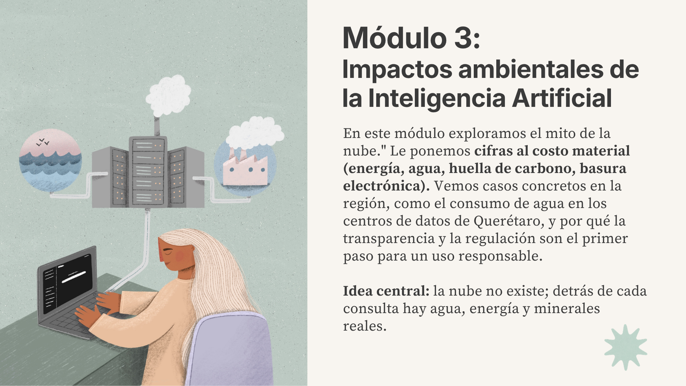
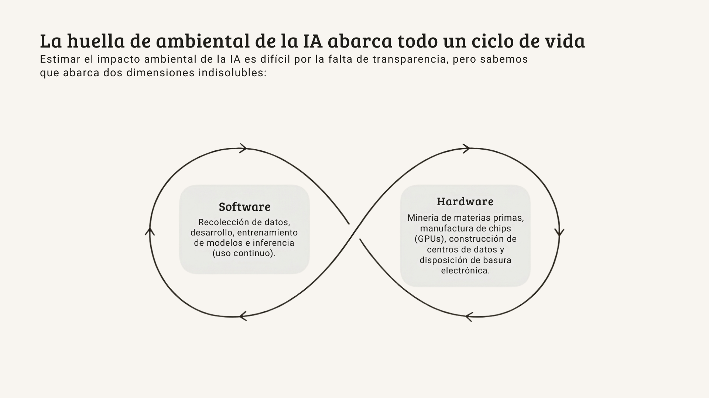

# El mito de la nube: impactos ambientales de la IA

Cuando "subimos" algo a la nube o le hacemos una pregunta a ChatGPT, la mayoría de las personas imaginamos algo etéreo e intangible. Pero detrás de esa interfaz hay edificios enormes que consumen electricidad las 24 horas del día, agua para enfriar servidores, y extracción de minerales para construir semiconductores y chips.

Este módulo explora el costo ambiental de la Inteligencia Artificial: quién lo paga, cómo se distribuye y qué podemos hacer al respecto.

!!! danger "El Límite de los 1.5°C"
    En 2024, las temperaturas globales superaron **1.5°C sobre niveles preindustriales durante 12 meses consecutivos**.[^13] Al ritmo actual, se proyecta alcanzar este umbral de forma permanente para **2029**.[^29] Para evitarlo, las emisiones de CO2 deben reducirse **45% para 2030 y alcanzar cero neto para 2050**, pero actualmente emitimos ~42 GtCO2 al año.[^2] La diferencia entre 1.5°C y 2°C significa **el doble de personas expuestas a sequías severas**, la pérdida de prácticamente **todos los arrecifes de coral**, y veranos árticos sin hielo.[^2] Cada nueva fuente de emisiones cuenta, y la IA es una de las que más rápido crece.

## La infraestructura física detrás de lo digital

Cuando la IA "aprende" o "responde", todo ese proceso ocurre en edificios físicos conectados por cables de bajo del mar. Casi el **100% del tráfico de internet** pasa por cables submarinos de fibra óptica tendidos en el fondo del océano.[^3] Esos cables conectan a los centros de datos, edificios que concentran la infraestructura informática necesaria para crear, ejecutar y proporcionar aplicaciones y servicios, entre ellos correr modelos de IA.[^35]

!!! info "La demanda de centros de datos"
    Existen aproximadamente **10,000 centros de datos en 164 países**.[^16] De estos, 1,189 son "hiperescala", los más grandes, como los que operan Google, Amazon y Microsoft y la mitad de ellos (el 54%) están en Estados Unidos. América Latina tiene 251 centros de datos, concentrados en países como Brasil (37.2%), Chile (13.4%) y México (12.3%).[^17]

Cada centro de datos requiere:

- **Electricidad constante** para los servidores (las 24 horas, los 365 días del año)
- **Agua** para los sistemas de enfriamiento
- **Hardware** fabricado con minerales críticos como el galio, germanio, cobalto, litio, tantalio

## Evaluar el ciclo de vida de la IA

Para conocer la huella ambiental de la IA debemos considerar sus impactos a través de su ciclo de vida, que se compone de dos dimensiones, el software y hardware.[^15] El **ciclo de software** incluye la recolección de datos, el desarrollo de los modelos, entrenamiento, validación, despliegue, inferencia, mantenimiento y retiro. El **ciclo de hardware** abarca la producción de chips y GPUs, la construcción y operación de centros de datos, desde la extracción de materias primas, pasando por la manufactura y el transporte, hasta la operación, mantenimiento y disposición de basura electrónica. 

!!! warning "Los datos que tenemos (y los que no)"
    Aunque existen estudios sobre el impacto ambiental de distintas etapas del ciclo de vida de la IA, **la investigación comprehensiva sigue siendo escasa**.[^15] Esto ha provocado la proliferación de estadísticas en medios de comunicación, muchas sin respaldo riguroso. Estimar con precisión el impacto ambiental de la IA es difícil por los retos de medición, particularmente la falta de datos sobre efectos indirectos. Para conocer los impactos en cada etapa y aspecto (minerales, energía, emisiones, agua y basura digital) se necesitan más y mejores datos.[^15] Los datos de este módulo son los mejores disponibles que pudimos encontrar, pero deben leerse con esa cautela.

## ¿Cuánta energía consumen los centros de datos?

En 2024, centros de datos a nivel mundial consumieron **415 TWh de electricidad,** que representa cerca del 1.5% del consumo eléctrico global. Para 2030, la Agencia Internacional de Energía proyecta que esta cifra se duplique, llegando a **945 TWh**.[^19] Esta cifra es ligeramente superior al consumo total de electricidad actual de todo Japón.[^19] Además, la energía necesaria para entrenar los modelos de frontera **se duplica cada año** (crecimiento de 2.1x anual), más rápido que las mejoras en eficiencia del hardware.[^37]

El consumo de energía de los centros de datos es un problema. Pero el problema más profundo es **de dónde viene esa energía**. Casi la **mitad de la electricidad** que consumen los centros de datos en Estados Unidos proviene de centrales de combustibles fósiles.[^31] Cuando Meta anunció Hyperion, su centro de datos de IA en Luisiana, que consumirá **más del doble de energía que toda la ciudad de Nueva Orleans**, los reguladores aprobaron la construcción de **tres nuevas plantas de gas natural** para alimentarlo.[^31]

### ¿Cuánto contamina la IA?

El sector TIC en su conjunto (centros de datos, redes, dispositivos) genera unas **700 millones de toneladas de CO2 equivalente (MtCO2e)** al año, lo que representa el **1.4% de las emisiones globales**.[^5] La Agencia Internacional de Energía (AIE) estima que los centros de datos son responsables de aproximadamente **180 millones de toneladas**, es decir, el **0.5% de las emisiones globales**.[^19] Puede parecer poco, pero la demanda energética de los centros de datos está creciendo rápidamente y se proyecta que se duplique para 2030.[^19][^30]

#### ¿Cuánto contamina un modelo de lenguaje?

Uno de los primeros estudios que puso el tema en la agenda pública fue *"Energy and Policy Considerations for Deep Learning in NLP"*, publicado en 2019. De acuerdo con esta investigación, entrenar un modelo NAS emitió **~284 toneladas de CO2**, equivalente a **cinco veces las emisiones de un auto durante toda su vida útil**, incluyendo su fabricación. Incluso entrenar un solo modelo BERT emitió tanto CO2 como un vuelo transatlántico.[^4]

Un estudio posterior de Luccioni, Viguier y Ligozat (2022) demostró que la fuente de electricidad importa tanto o más que el tamaño del modelo.[^6] BLOOM (176B parámetros) consumió 433,196 kWh de energía, comparable a GPT-3. Pero porque se entrenó en Francia (donde el 70% de la electricidad es nuclear), emitió solo **25 toneladas de CO2** frente a las **502 toneladas de GPT-3** (entrenado con electricidad estadounidense). Si incluimos manufactura de hardware y consumo idle, el total de BLOOM sube a 50.5 toneladas, aun así, **10 veces menos que GPT-3**.[^6]

??? example "Medir lo que la industria prefiere ignorar"
    **Sasha Luccioni** es investigadora franco-canadiense y líder de clima en Hugging Face. Su trabajo ha sido pionero en medir las emisiones reales de modelos de IA: desde calcular la huella de carbono completa de BLOOM[^6] hasta demostrar que generar una imagen consume 1,450 veces más energía que clasificar un texto.[^14] Es una de las voces más visibles en la intersección de IA y cambio climático.

La inferencia, es decir, cada vez que preguntamos algo a ChatGPT, representa más del 80% del consumo eléctrico total de la IA. Amazon estima que hasta el **90% de los costos de ML en producción** se deben a la inferencia, no al entrenamiento.[^5] Para modelos populares como ChatGPT, bastaron semanas o meses de uso para que las emisiones acumuladas por inferencia superaran las del entrenamiento.[^7]

Las emisiones anuales por inferencia de un solo modelo (GPT-4o) se estiman entre **138,125 y 163,441 toneladas de CO2 equivalente por año**. [^20] Estas cifras son comparables a las
emisiones anuales de 30,000 automóviles de gasolina o a las emisiones acumuladas de aproximadamente 2,300 vuelos transatlánticos entre Boston y Londres. [^20]

Pero no todas las tareas de IA consumen lo mismo. Un estudio de Luccioni et al. (2024) midió el consumo de 88 modelos y encontró que **generar una imagen consume 1,450 veces más energía que clasificar un texto**.[^14] Además, los modelos multipropósito (como ChatGPT) son **33 veces más caros** energéticamente que modelos especializados para la misma tarea.[^14]

!!! info "La Paradoja de Jevons: más eficiente no significa menos impacto"
    La **Paradoja de Jevons** (1865) establece que cuando una tecnología se vuelve más eficiente, su uso total tiende a aumentar, no a disminuir. William Stanley Jevons observó que las mejoras en las máquinas de vapor no redujeron el consumo de carbón: lo aumentaron, porque hicieron que el carbón fuera viable para más usos.[^27] Lo mismo ocurre con la IA: Google reporta que la energía por consulta se redujo 33 veces en 12 meses y la huella de carbono por consulta 44 veces, pero su consumo total sigue creciendo porque el número de consultas crece más rápido que la eficiencia.[^26] La eficiencia tecnológica sola no resuelve el problema: hace falta políticas públicas y rendición de cuentas corporativa.

La mayoría de estas cifras son estimaciones de investigadores independientes, no datos oficiales. De las principales compañías de IA, la gran mayoría no divulga métricas ambientales desagregadas sobre su consumo energético, emisiones de carbono o uso de agua.[^36] Las personas que investigan, la presa y sociedad civil deben inferir el consumo a partir de datos indirectos como envíos de chips, eficiencia estimada y composición de cargas de trabajo, lo que explica por qué las estimaciones varían ampliamente entre estudios.[^36] Y cuando las empresas sí publican datos, no siempre reflejan la realidad.

### Huella de carbono y greenwashing

Las grandes empresas tecnológicas se comprometieron públicamente a reducir sus emisiones en los próximos años, pero la demanda de energía de los centros de datos apunta hacia otra dirección:

- **Microsoft** prometió ser "carbono negativo" para 2030, pero sus emisiones crecieron **29% desde 2020**, y su consumo eléctrico casi se triplicó.[^12]
- **Google** prometió "net-zero" para 2030 y abandonó su compromiso de "neutralidad operativa de carbono" en 2023. Sus emisiones crecieron **casi 50% en cinco años**.[^12]

!!! warning "¿Qué son los RECs y por qué importan?"
    Las empresas tecnológicas afirman operar con energía renovable comprando **Certificados de Energía Renovable (RECs)**. Es decir, compran créditos de alguien que produce energía verde en otro lugar, mientras sus centros de datos funcionan con carbón y gas natural de de forma local. Es el equivalente a afirmar que reciclas porque compraste un bono de reciclaje de alguien en otro país, pero tirar cada vez más basura en tu propio país. 16 fiscales generales de Estados Unidos han investigado a Amazon, Google, Meta y Microsoft por este tipo de afirmaciones.[^12]

## El agua que consume la IA

El impacto de los centros de datos no se limita a la energía. Como vimos en el [Módulo 1](01-que-es-la-ia.md), los modelos de deep learning realizan miles de millones de operaciones matemáticas para ajustar sus parámetros, cada una de esas operaciones genera calor en los procesadores. 

Para evitar que los servidores se sobrecalienten, los centros de datos usan dos tipos de enfriamiento: **sistemas de aire acondicionado** (que consumen electricidad) o **enfriamiento con agua** (que consume agua directamente). Los sistemas de enfriamiento representan entre el **7% (centros hiperescala)** y el **30% (centros empresariales)** del consumo eléctrico total de un centro de datos.[^19] A nivel global, los centros de datos consumen alrededor de **560 mil millones de litros de agua por año**, y esto podría aumentar hasta alcanzar unos 1200 mil millones de litros al año en 2030.[^19]  

El problema no es solo el consumo, sino lo que las empresas ocultan. En Uruguay, Google clasificó los datos de consumo de agua y energía de su centro de datos en Canelones como **"secreto industrial y comercial"**. Fue necesario un fallo judicial para obligar al Ministerio de Ambiente a revelar que el proyecto consumiría hasta **7.6 millones de litros de agua potable por día**.[^32]  

### Caso de estudio: Querétaro, México

<!-- TODO: Add 03_Queretaro.png -->

Querétaro concentra el **65% de la capacidad de centros de datos de México**, con inversiones de AWS, Microsoft y Google Cloud.[^18] Al mismo tiempo, **17 de sus 18 municipios** experimentaron sequía moderada a severa en 2025.[^38] Residentes de Viborillas y Colón reportan recibir agua solo tres días por semana, y tanto las empresas como el gobierno estatal han negado solicitudes de información sobre uso de agua e impacto comunitario.[^24]

!!! example "La voz de las comunidades afectadas"
    "Estos centros de datos están en medio de áreas que se usaban para la recarga de acuíferos, la agricultura o la ganadería, que son fuente de ingreso para muchas familias." — Activista local, Voceras de la Madre Tierra.[^24]

Las preguntas de fondo son: ¿quién decide cómo se asigna el agua, un recurso con demanda inelástica para hogares y agricultura, cuando compite con inversión tecnológica extranjera? ¿a dónde se van los beneficios?
## La cadena de suministro oculta: minerales y basura electrónica

La IA no solo consume energía y agua. Su hardware requiere minerales críticos que se extraen principalmente en el Sur Global. De 2001 a 2022, el número de chips vendidos se **cuadruplicó**, y la demanda no muestra señales de desaceleración.[^15] Además, la IA y la transición energética compiten por los mismos recursos escasos. Los minerales necesarios para la digitalización son prácticamente los mismos que se requieren para la transición a energías limpias: cobre, litio, cobalto, tierras raras.  

!!! warning "De los modelos de IA a las minas"
    Cada GPU de alto rendimiento contiene cobalto. La cadena de suministro de la IA comienza en minas donde, según Amnistía Internacional, trabajan niños en condiciones documentadas de abuso y trabajo forzado.[^1]

La minería de estos materiales tiene impactos ambientales como la contaminación de agua y aire, degradación de biodiversidad, emisiones de gases de efecto invernadero. El **52% de las minas de cobre** están en zonas de alto estrés hídrico y el reciclaje de estos materiales es bajo, **46% para cobre** y apenas **1% para tierras raras**.[^15]

!!! example "Litio en América Latina"
    El "Triángulo del Litio" (Chile, Argentina, Bolivia) contiene las mayores reservas de litio del mundo. La minería en el Salar de Atacama ha causado una **reducción del 30% en los niveles de agua**, con pérdida de vegetación y declive en poblaciones de flamencos. Más de **400 comunidades indígenas** habitan las regiones impactadas.[^10] México ocupa el **9no lugar mundial en reservas de litio** (1.7 millones de toneladas) y nacionalizó el mineral en 2022 con la creación de LitioMx.[^10]

### Basura electrónica (e-waste)

A nivel global se generan **62 millones de toneladas de basura electrónica al año**, y solo el **22.3% se recicla formalmente**.[^11] La IA agrava este problema:

- Las GPUs de alto rendimiento tienen una vida útil de **1 a 3 años** en ambientes de IA (versus 3-5 años en servidores tradicionales)[^11]
- Se estima que las tecnologías de IA generarán **2.5 millones de toneladas de basura electrónica al año para 2030**[^11]
- En 2024, una sola empresa envió más de 3.7 millones de GPUs, un millón más que el año anterior[^20]

## Justicia ambiental y colonialismo digital

América Latina y el Caribe contribuye solo el **~6.7% de las emisiones globales**, pero es una de las regiones **más vulnerables** al cambio climático.[^25] En 2024 se registraron huracanes récord, la primera tormenta Categoría 5 más temprana en la historia, sequías devastadoras e inundaciones mortales en la región.[^25]

Los impactos ambientales de la IA no se distribuyen de forma equitativa, las herramientas se crean en el Norte Global pero dependen de extracción e infraestructura en el Sur Global. Además, el financiamiento climático para la región representa solo el **0.5% del PIB**, necesita multiplicarse 8-10 veces. La mayoría llega como préstamos, no como donaciones, incrementando la deuda regional.[^25]

## ¿Qué se está haciendo?

El panorama es complejo, pero no está fuera de nuestro control. Desde la regulación internacional hasta las decisiones individuales, existen acciones concretas que pueden reducir el impacto ambiental de la IA.

### Regulación internacional

| Iniciativa | Qué propone | Estado |
|------------|-------------|--------|
| **Ley de IA de la UE** (Reg. 2024/1689) | Documentación de consumo energético, transparencia y códigos de conducta sobre sostenibilidad ambiental | Aplicable desde agosto 2026 |
| **Política de Centros de Datos de Brasil** (sept 2025) | Energía renovable o limpia, altos estándares de eficiencia hídrica, incentivos fiscales | Vigente |
| **COP30** (Belém, Brasil, nov 2025) | Primera cumbre climática en integrar la IA como tema central. Propuestas: pruebas de interés público obligatorias, 100% energía renovable in situ | En discusión |
| **Orden Ejecutiva EE.UU.** (enero 2025) | Requisitos de reporte para centros de datos de IA cubriendo todo el ciclo de vida | En desarrollo |

### Técnicas para hacer más eficiente los modelos

- **Destilación de modelos:** Crear modelos más pequeños usando modelos grandes como "maestros". DistilBERT logra ~60% más velocidad con ~40% menos parámetros y ~97% del rendimiento original.[^28]
- **Compresión de modelos:** Puede reducir el consumo energético 10-100 veces sin pérdida significativa de precisión.[^28]

### Acciones individuales y colectivas

1. **Escribir mejores prompts:** Prompts claros y específicos reducen el cómputo necesario (los reenvíos y reintentaciones son especialmente costosos)
2. **Cuestionar la necesidad:** ¿Es realmente necesaria la IA para esta tarea, o una búsqueda simple o el propio razonamiento logra lo mismo con menos energía?
3. **Usar modelos más pequeños:** Para tareas simples, modelos anteriores o más chicos funcionan bien con menos recursos. Usar un modelo especializado en lugar de uno multipropósito puede reducir el consumo energético **33 veces**[^14]
4. **Organizarnos colectivamente:** Las decisiones individuales importan, pero son insuficientes sin política pública y rendición de cuentas corporativa

!!! tip "DataCenterBoom: investigación latinoamericana sobre centros de datos"
    **[DataCenterBoom](https://datacenterboom.net/)** es una iniciativa del Instituto Latinoamericano de Terraformación que investiga y documenta los impactos socioambientales de los centros de datos en América Latina. Sus publicaciones incluyen análisis técnicos sobre consumo de agua y cálculo de emisiones, así como un informe sobre los **casos judiciales contra Google en Chile y Uruguay**, donde comunidades locales lograron, a través de los tribunales, que se anularan permisos ambientales y se obligara a revelar datos de consumo hídrico que la empresa había clasificado como "secreto industrial".[^32] El Acuerdo de Escazú fue una herramienta legal clave en ambos casos. DataCenterBoom mapea proyectos de centros de datos en Brasil, Chile y México, proporcionando información que las propias empresas y gobiernos no hacen pública.

## **De la nube a la tierra: ¿qué sigue?**

La IA no es etérea ni intangible. Detrás de cada consulta, cada imagen generada y cada modelo entrenado hay edificios que consumen electricidad las 24 horas, agua que se evapora para enfriar servidores, y minerales extraídos en condiciones que muchas veces violan derechos humanos.

En el **[Módulo 1](01-que-es-la-ia.md)** aprendimos cómo funcionan los modelos de IA. Ahora podemos ponerle cifras a ese proceso: entrenar GPT-4 requirió ~50,000 MWh de electricidad.[^8] En el **[Módulo 2](02-sesgos-algoritmicos.md)** vimos que los sesgos se distribuyen de forma desigual. El mismo patrón aplica aquí: América Latina contribuye solo el 6.7% de las emisiones globales pero absorbe una parte desproporcionada de los costos ambientales de la infraestructura digital.[^25] El colonialismo digital es, también, un sesgo estructural.

La transparencia es el primer paso. Sin datos confiables sobre consumo de energía, agua y emisiones, no es posible regular, exigir cuentas ni tomar decisiones informadas.  

!!! info "Lo que viene"
    **Módulo 4: IA y el futuro del trabajo.** ¿Qué empleos están en riesgo, cuáles se transforman y cuáles se crean? Especialmente para economistas en América Latina, ¿cómo pensar en la IA como herramienta y no como amenaza?

??? abstract "Glosario de conceptos clave"
    | Concepto | Definición breve |
    |----------|-----------------|
    | Centro de datos (*data center*) | Instalación física con servidores, sistemas de almacenamiento y redes que procesan y alojan datos digitales. Requiere electricidad constante y grandes volúmenes de agua para enfriamiento |
    | Inferencia | Cuando un modelo ya entrenado aplica lo aprendido a datos nuevos. Representa el 80% del consumo eléctrico total de la IA |
    | PUE (*Power Usage Effectiveness*) | Métrica de eficiencia energética de un centro de datos. Un PUE de 1.0 sería perfecto; la industria promedia ~1.5 |
    | RECs (*Renewable Energy Certificates*) | Certificados de Energía Renovable. Permiten a una empresa afirmar que opera con energía renovable comprando créditos de otro productor, aunque sus instalaciones usen carbón o gas |
    | Greenwashing | Práctica de afirmar compromisos ambientales sin cambios reales en el impacto. En el contexto de la IA, el uso de RECs en lugar de energía renovable genuina |
    | Paradoja de Jevons | Principio económico (1865): cuando una tecnología se vuelve más eficiente, su uso total tiende a aumentar, no a disminuir |
    | E-waste (*basura electrónica*) | Residuos de equipos eléctricos y electrónicos. Las GPUs de IA tienen vida útil de 1-3 años y se reemplazan con frecuencia |
    | Triángulo del Litio | Región de Chile, Argentina y Bolivia con las mayores reservas de litio del mundo, esencial para baterías y hardware de IA |
    | Colonialismo digital | Patrón estructural donde los datos fluyen al Norte Global, las decisiones se toman remotamente y los costos ambientales se externalizan al Sur Global |
    | Externalidades negativas | Costos generados por una actividad económica que son absorbidos por terceros no involucrados en la transacción. El costo ambiental de la IA es una externalidad para las comunidades donde se instalan los centros de datos |
    | Hiperescala (*hyperscale*) | Centros de datos de muy gran tamaño operados por empresas como Amazon, Google o Microsoft, con capacidades de cómputo masivas |
    | Destilación de modelos | Técnica para crear modelos más pequeños y eficientes a partir de modelos grandes, manteniendo la mayor parte del rendimiento original |
    | WUE (*Water Usage Effectiveness*) | Métrica de eficiencia hídrica de un centro de datos, en litros por kWh. El promedio de la industria es 1.9 L/kWh; el ideal (0) solo se logra con enfriamiento por aire seco |
    | Acuerdo de Escazú | Tratado regional latinoamericano que garantiza derechos de acceso a la información ambiental, participación pública y justicia en asuntos ambientales. Herramienta legal clave en casos contra centros de datos |

??? tip "Recursos para seguir aprendiendo"
    **Investigación periodística:**

    - Context/Thomson Reuters — "Thirsty Data Centres in Mexico": <https://www.context.news/ai/thirsty-data-centres-spring-up-in-water-poor-mexican-town>
    - Context — "Resistance Blooms in Mexico's Data Centre Valley": <https://www.context.news/ai/long-read/resistance-blooms-in-mexicos-data-centre-valley>
    - NPR — "AI Brings Soaring Emissions" (2024): <https://www.npr.org/2024/07/12/g-s1-9545/ai-brings-soaring-emissions-for-google-and-microsoft-a-major-contributor-to-climate-change>

    **Reportes institucionales:**

    - IEA — "Energy and AI" (2025): <https://www.iea.org/reports/energy-and-ai/executive-summary>
    - UNEP — "AI Has an Environmental Problem": <https://www.unep.org/news-and-stories/story/ai-has-environmental-problem-heres-what-world-can-do-about>
    - Global E-waste Monitor (2024): <https://www.unep.org/resources/global-e-waste-monitor-2024>

    **Análisis sobre la Paradoja de Jevons y IA:**

    - MIT Technology Review — "DeepSeek and Energy" (2025): <https://www.technologyreview.com/2025/01/31/1110776/deepseek-might-not-be-such-good-news-for-energy-after-all/>
    - NPR — "AI, DeepSeek, and Jevons Paradox" (2025): <https://www.npr.org/sections/planet-money/2025/02/04/g-s1-46018/ai-deepseek-economics-jevons-paradox>

    **Minerales y derechos humanos:**

    - Amnistía Internacional — "This Is What We Die For": <https://www.amnestyusa.org/reports/this-is-what-we-die-for-human-rights-abuses-in-the-democratic-republic-of-the-congo-power-the-global-trade-in-cobalt/>
    - Mongabay — "Lithium Mining in Atacama" (2024): <https://news.mongabay.com/2024/12/as-lithium-mining-bleeds-atacama-salt-flat-dry-indigenous-communities-hit-back/>
    - CSIS — "From Mine to Microchip" (2024): <https://www.csis.org/analysis/mine-microchip>

    **Justicia ambiental en LatAm:**

    - Heinrich Böll Stiftung — "COP30, AI, Climate Justice": <https://br.boell.org/en/2025/10/14/cop30-ai-climate-justice-ally-or-new-face-extractivist-model>
    - **"Atlas of AI" — Kate Crawford (2021)** — Mapea la cadena de suministro material de la IA
    - DataCenterBoom — Base de datos sobre impactos de centros de datos en América Latina (Brasil, Chile, México): <https://datacenterboom.net/>

---

## Referencias

[^1]: Amnistía Internacional (2016). "This Is What We Die For: Human Rights Abuses in the DRC Power the Global Trade in Cobalt." <https://www.amnestyusa.org/reports/this-is-what-we-die-for-human-rights-abuses-in-the-democratic-republic-of-the-congo-power-the-global-trade-in-cobalt/>
[^2]: IPCC (2018). "Global Warming of 1.5°C — Summary for Policymakers." <https://www.ipcc.ch/sr15/chapter/spm/>
[^3]: The New York Times. (2019). "How the Internet Travels Across Oceans".  https://www.nytimes.com/interactive/2019/03/10/technology/internet-cables-oceans.html
[^4]: Strubell, E., Ganesh, A. & McCallum, A. (2019). "Energy and Policy Considerations for Deep Learning in NLP." *Proceedings of the 57th Annual Meeting of the ACL*, pp. 3645–3650. <https://aclanthology.org/P19-1355/>
[^5]: Kaack, L.H., Donti, P.L., Strubell, E., Kamiya, G., Creutzig, F. & Rolnick, D. (2021). "Aligning artificial intelligence with climate change mitigation." Preprint. <https://hal.science/hal-03368037>
[^6]: Luccioni, A.S., Viguier, S. & Ligozat, A.-L. (2022). "Estimating the Carbon Footprint of BLOOM, a 176B Parameter Language Model." *arXiv preprint arXiv:2211.02001*. <https://arxiv.org/abs/2211.02001>
[^7]: Climate Impact Partners (2024). "Carbon Footprint of AI." <https://www.climateimpact.com/news-insights/insights/carbon-footprint-of-ai/>
[^8]: Epoch AI (2024). Energy consumption of AI model training.
[^9]: Dgtl Infra (2024). Data center water consumption statistics.
[^10]: Mongabay (2024). "As Lithium Mining Bleeds Atacama Salt Flat Dry, Indigenous Communities Hit Back." <https://news.mongabay.com/2024/12/as-lithium-mining-bleeds-atacama-salt-flat-dry-indigenous-communities-hit-back/>
[^11]: UNEP / Global E-waste Monitor (2024). <https://www.unep.org/resources/global-e-waste-monitor-2024>
[^12]: NPR (2024). "AI Brings Soaring Emissions for Google and Microsoft." <https://www.npr.org/2024/07/12/g-s1-9545/ai-brings-soaring-emissions-for-google-and-microsoft-a-major-contributor-to-climate-change>
[^13]: Copernicus Climate Change Service (2024). "Why do we keep talking about 1.5°C and 2°C above the pre-industrial era?" <https://climate.copernicus.eu/why-do-we-keep-talking-about-15degc-and-2degc-above-pre-industrial-era>
[^14]: Luccioni, A.S., Jernite, Y. & Strubell, E. (2024). "Power Hungry Processing: Watts Driving the Cost of AI Deployment?" *ACM FAccT '24*, pp. 85–99. <https://arxiv.org/abs/2311.16863>
[^15]: UNEP (2024). "Artificial Intelligence (AI) end-to-end: The environmental impact of the full AI life cycle needs to be comprehensively assessed." <https://wedocs.unep.org/rest/api/core/bitstreams/07b3c8fc-bd30-4b92-b5f4-d665e927b59d/content>
[^16]: Cargoson (2025). Data center statistics. Global data center count.
[^17]: Brightlio (Q1 2025). Global hyperscale data center inventory.
[^18]: MEXDC / Prodensa (2025). "Data Centers in Mexico." <https://www.prodensa.com/insights/blog/data-centers-in-mexico>
[^19]: IEA (2025). "Energy and AI." <https://www.iea.org/reports/energy-and-ai/ai-and-climate-change>
[^20]: ArXiv (2025). GPT-4o inference emissions and GPU deployment data. <https://arxiv.org/abs/2501.16548>
[^21]: Sam Altman. The Gentle Singularity. <https://blog.samaltman.com/the-gentle-singularity>
[^22]: Digital Information World (2025) / Fast Company (2025) / The Invading Sea (2025). Big Tech water consumption reports.
[^23]: Context (2025). "Thirsty Data Centres Spring Up in Water-Poor Mexican Town." <https://www.context.news/ai/thirsty-data-centres-spring-up-in-water-poor-mexican-town>
[^24]: Context (2025). "Resistance Blooms in Mexico's Data Centre Valley." <https://www.context.news/ai/long-read/resistance-blooms-in-mexicos-data-centre-valley>
[^25]: Heinrich Böll Stiftung (2025). "COP30, AI and Climate Justice." <https://br.boell.org/en/2025/10/14/cop30-ai-climate-justice-ally-or-new-face-extractivist-model>
[^26]: MIT Technology Review (2025). "DeepSeek Might Not Be Such Good News for Energy After All." <https://www.technologyreview.com/2025/01/31/1110776/deepseek-might-not-be-such-good-news-for-energy-after-all/>
[^27]: NPR Planet Money (2025). "AI, DeepSeek, and the Economics of the Jevons Paradox." <https://www.npr.org/sections/planet-money/2025/02/04/g-s1-46018/ai-deepseek-economics-jevons-paradox>
[^28]: Google Cloud (2025). Model compression and distillation techniques.
[^29]: Copernicus Climate Change Service (2025). "Rapid approach of the 1.5°C global warming threshold of the Paris Agreement." <https://climate.copernicus.eu/rapid-approach-15degc-global-warming-threshold-paris-agreement>
[^30]: IEA (2025). "Electricity 2025 — Emissions." <https://www.iea.org/reports/electricity-2025/emissions>
[^31]: Gorey, J. (2025). "Data Drain: The Land and Water Impacts of the AI Boom." *Lincoln Institute of Land Policy, Land Lines Magazine*. <https://www.lincolninst.edu/publications/land-lines-magazine/articles/land-water-impacts-data-centers/>
[^32]: Vallejos, R. (2025). "Los data centers llegan a tribunales en América Latina: Análisis de los fallos de la justicia sobre los data centers de Google en Chile y Uruguay." *DataCenterBoom / Instituto Latinoamericano de Terraformación*. <https://datacenterboom.net/wp-content/uploads/2025/11/Los-data-centers-llegan-a-tribunales-en-America-Latina-1.pdf>
[^33]: DataCenterBoom (2025). "¿Cómo se calculan las emisiones de gases invernadero de un centro de datos?" Basado en Uptime Institute Global Survey of IT and Data Center Managers (2024). <https://datacenterboom.net/>
[^34]: CSIS (2024). "From Mine to Microchip: Building a Critical Mineral Strategy for Semiconductors." Análisis. <https://www.csis.org/analysis/mine-microchip>
[^35]: IBM. "¿Qué es un data center?". <https://www.ibm.com/mx-es/think/topics/data-centers>
[^36]: Federation of American Scientists (2025). "Measuring AI's Energy/Environmental Footprint to Access Impacts." <https://fas.org/publication/measuring-and-standardizing-ais-energy-footprint/>
[^37]: Emberson, L. & Rahman, R. (2024). "The power required to train frontier AI models is doubling annually." Epoch AI. <https://epoch.ai/data-insights/power-usage-trend>
[^38]: El Economista, México. "# Sequía moderada cubre 94.4% de los municipios de Querétaro". <https://www.eleconomista.com.mx/estados/sequia-moderada-cubre-94-4-municipios-queretaro-20250421-755758.html>
