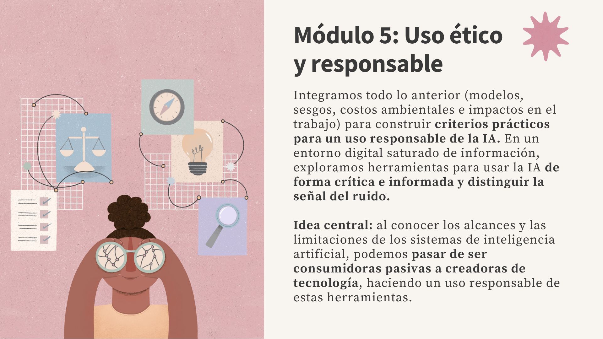

# Herramientas y uso ético y responsable de la IA

!!! abstract "¿Cómo pasar de ser consumidoras a constructoras de IA?"
    La primera parte de este módulo es una guía para un uso informado y crítico, organizada en el marco de las **4D**: Delegación (decidir cuándo usar IA y cuándo no), Descripción (pedirle lo que necesitas con buenos prompts), Discernimiento (verificar lo que produce con métodos como SIFT, porque las alucinaciones y las citas inventadas son inherentes a los modelos) y Diligencia (privacidad, transparencia y supervisión humana). La segunda parte da un paso más allá del consumo: el **software libre y la soberanía digital** (modelos open source como Llama o Mistral, cómo correrlos localmente con Ollama y LLMs con enfoque en privacidad) y **AymurAI**, una IA feminista y de código abierto creada en América Latina. La idea de fondo: pasar de ser consumidoras pasivas de tecnología a personas capaces de cuestionarla, elegirla y construirla.



## De consumidoras a constructoras

Esta serie construyó las bases para entender qué hay detrás de la inteligencia artificial: [cómo funcionan los modelos](01-que-es-la-ia.md), [los sesgos que reproducen](02-sesgos-algoritmicos.md), [su costo ambiental](03-impactos-ambientales.md) y [cómo están transformando el trabajo](04-futuro-del-trabajo.md). El 66% de la población mexicana ya usa alguna herramienta de IA[^1] y el 88% de estudiantes universitarios la utiliza para tareas académicas.[^2] La demanda de habilidades de IA en México creció **+148% entre 2023 y 2025**.[^3] Pero usar una herramienta no es lo mismo que entenderla.

El objetivo de este módulo es que dejes de ser una consumidora pasiva de tecnología para convertirte en alguien capaz de usar la IA de forma informada y crítica y, cuando el problema lo amerite, construirla desde tu propio contexto.

## Las 4D: un marco para usar la IA con criterio

Saber que la IA tiene limitaciones es necesario, pero no suficiente. Necesitas un marco para decidir *cómo* interactuar con ella. El **AI Fluency Framework** propone que la fluidez en IA es "la capacidad de trabajar de manera **efectiva, eficiente, ética y segura** dentro de las modalidades emergentes de interacción humano-IA."[^4]

| Competencia | Qué implica | Pregunta clave |
|-------------|------------|-----------------|
| **Delegación** | Decidir *si*, *cuándo* y *cómo* usar IA | ¿Esta tarea se beneficia de IA? ¿Cuáles son sus limitaciones? |
| **Descripción** | Comunicar tu visión para que la IA produzca algo útil | ¿Mi instrucción es específica? ¿Definí formato, tono, audiencia? |
| **Discernimiento** | Evaluar críticamente lo que la IA produce | ¿Este resultado es preciso? ¿Las fuentes existen? |
| **Diligencia** | Asumir responsabilidad por lo que produces con IA | ¿Verifiqué los hechos? ¿Soy transparente sobre el uso de IA? |

!!! abstract "Las 4D en la práctica"
    - **Delegación** te dice *si* debes usar IA para esta tarea.
    - **Descripción** te dice *cómo* pedirle lo que necesitas.
    - **Discernimiento** te dice *si el resultado sirve*.
    - **Diligencia** te dice *qué responsabilidad asumes*.

    Las cuatro se necesitan. Sin Delegación, usas IA cuando no deberías. Sin Descripción, obtienes resultados poco útiles. Sin Discernimiento, aceptas esos resultados. Sin Diligencia, los publicas.

Vale la pena notar algo desde el inicio: este marco, como buena parte del vocabulario dominante de la IA, viene de las empresas que la construyen. Es útil, pero usarlo de forma crítica también implica preguntar *quién define los marcos con los que aprendemos a pensar la tecnología*. Esa pregunta nos acompañará hasta el final del módulo.

### 1. Delegación — ¿cuándo usar IA y cuándo no?

La primera decisión no es *cómo* usar la IA, sino *si* deberías. Antes de delegar una tarea, conviene entender dos cosas: qué tipo de IA tienes enfrente y qué tan autónoma quieres que sea.

No toda la IA es igual. La evolución va de herramientas que predicen, a herramientas que responden, a herramientas que actúan:[^5]

| Nivel | Qué hace | Ejemplo |
|-------|---------|---------|
| **IA Predictiva** (ML tradicional) | Aprende de datos históricos para clasificar o predecir, sin generar contenido nuevo | Un filtro de spam, un sistema de recomendaciones, un modelo de riesgo crediticio |
| **IA Generativa** | Produce contenido nuevo a partir de lo que aprendió | ChatGPT respondiendo una pregunta |
| **Agentes de IA** | Logran un objetivo, automatizan un flujo completo | Un asistente que busca en internet, ejecuta código y genera un reporte |
| **IA Agéntica** | Varios agentes autónomos colaboran y se adaptan en tiempo real | Uno busca datos, otro los limpia, otro analiza y otro redacta, con una sola instrucción |


A esto se suman tres **modos de interacción**, según cuánta autonomía le des:[^4]

| Modo | Qué pasa | Ejemplo |
|------|---------|---------|
| **Automatización** | La IA ejecuta una tarea que tú defines | Resumir un documento, generar un correo |
| **Aumentación** | Humano e IA co-crean iterativamente | Escribir un ensayo juntos, analizar datos |
| **Agencia** | Configuras a la IA para actuar de forma independiente | Un agente que monitorea datos y actúa solo |

La regla es simple: **a mayor autonomía de la IA, mayor responsabilidad humana** en el diseño, la supervisión y la rendición de cuentas. Por eso el concepto de *human-in-the-loop* (humano en el ciclo) establece que los sistemas de IA deben mantener a una persona en los puntos críticos de decisión. La Ley de IA de la Unión Europea exige supervisión humana para todos los sistemas clasificados como de "alto riesgo": educación, empleo, migración y justicia.[^6] A mayor impacto potencial en la vida de las personas, mayor debe ser la intervención humana.

Antes de delegar, también hay que saber qué *no* conviene delegar. Estas limitaciones no son fallas temporales: son características estructurales de cómo funcionan los modelos actuales.

- **Fabrican hechos con confianza.** Las alucinaciones son inherentes al funcionamiento estadístico del modelo. Son [*loros estocásticos*](01-que-es-la-ia.md#loros-estocasticos-stochastic-parrots): predicen patrones, no entienden causalidad.[^7]
- **No razonan causa y efecto.** Detectan correlaciones, pero no determinan qué causa qué ni imaginan qué pasaría si cambiaras una variable.[^8]
- **Prefieren darte la razón.** El sesgo de *sicofancia* los hace tender a estar de acuerdo contigo en lugar de desafiarte.
- **No saben lo que no saben.** Tienen fechas de corte y lagunas culturales: solo ~4% de los datos de entrenamiento de los principales modelos están en español.[^9]
- **No son del todo reproducibles.** El mismo prompt puede dar respuestas distintas en momentos distintos.

!!! tip "La pregunta anti-tecnosolucionismo"
    No todo problema se resuelve con más tecnología. Antes de usar IA, pregúntate: ¿esta tarea realmente se beneficia de la IA, o solo estoy usándola porque está de moda? A veces la mejor decisión de diseño es *no* automatizar lo más sensible y dejar el juicio en manos humanas.

### 2. Descripción — ¿cómo pedirle lo que necesitas?

La segunda D es donde la mayoría de las personas usuarias se quedan cortas. Un *prompt* es la instrucción que le das a un modelo. La calidad de la respuesta depende directamente de la calidad de la pregunta: no es diferente de formular una buena pregunta de investigación.[^10]

Pedirle a ChatGPT "háblame de inflación" es como entrar a una biblioteca y gritar "¡economía!" La respuesta será genérica. Pero pedirle *"Explica las causas de la inflación en México entre 2021-2024, enfocándote en los factores de oferta, y compara con la experiencia de Brasil y Colombia"* produce algo utilizable.

| Técnica              | Qué es                                   | Ejemplo                                                                                      |
| -------------------- | ---------------------------------------- | -------------------------------------------------------------------------------------------- |
| **Zero-shot**        | Pedir algo sin dar ejemplos              | "Resume este artículo en 3 puntos clave"                                                     |
| **Few-shot**         | Dar 2-3 ejemplos del formato deseado     | "Aquí hay 2 ejemplos de cómo quiero el resumen: [ej. 1] [ej. 2]. Ahora resume este artículo" |
| **Chain-of-thought** | Pedir que razone paso a paso             | "Analiza este problema paso a paso antes de dar tu conclusión final"                         |
| **Role prompting**   | Asignar un rol al modelo                 | "Eres una economista especializada en política monetaria mexicana. Analiza..."               |
| **System prompt**    | Instrucción que define el comportamiento | "Siempre cita fuentes. Responde en español. Cuando no sepas algo, dilo."                     |
| **Dar contexto**[^11]     | Aportar la información de fondo que el modelo necesita: documentos, audiencia, restricciones | "Con base en este informe [texto], identifica los 3 riesgos principales para un público no experto" |

??? example "Framework CO-STAR para prompts estructurados"
    Un método para organizar prompts complejos:[^10]

    | Elemento | Significado | Ejemplo |
    |----------|------------|---------|
    | **C** - Context | Contexto de fondo | "Estoy escribiendo un ensayo sobre política fiscal en México" |
    | **O** - Objective | Qué quieres lograr | "Necesito un análisis de los argumentos a favor y en contra del aumento al salario mínimo" |
    | **S** - Style | Estilo de escritura | "En un tono académico pero accesible" |
    | **T** - Tone | Tono emocional | "Objetivo y balanceado, presentando ambos lados" |
    | **A** - Audience | Para quién es | "Estudiantes universitarios" |
    | **R** - Response format | Formato deseado | "Introducción, 3 argumentos a favor, 3 en contra, conclusión. Máximo 800 palabras" |

### 3. Discernimiento — ¿el resultado sirve?

Ahora que sabes pedirle a la IA, viene la habilidad más importante: saber cuándo *no* confiar en ella. Los modelos producen texto que *suena* autoritativo y profesional, incluso cuando es completamente falso. Las alucinaciones no vienen con advertencia: las cifras pueden ser inventadas y las citas académicas pueden no existir.[^12]

El método **SIFT**, desarrollado por Mike Caulfield para verificación de información digital, se adapta perfectamente para evaluar outputs de IA:[^13]

| Paso | Significado | Aplicación a IA |
|------|-----------|----------------|
| **S** - Stop | Para. No actúes de inmediato | Antes de usar o compartir un output, detente. No confíes automáticamente en texto que suena profesional |
| **I** - Investigate | Investiga la fuente | ¿Quién creó la herramienta? ¿Cuáles son sus limitaciones? ¿Con qué datos fue entrenada? |
| **F** - Find better coverage | Busca mejores fuentes | Contrasta con fuentes autoritativas: organismos oficiales, datos abiertos, papers académicos |
| **T** - Trace to original | Rastrea al original | Si la IA cita una fuente, **verifícala**. Busca el paper o artículo real. Muchas citas de IA son inventadas |

!!! danger "Las citas de IA pueden ser inventadas"
    Si una estadística o una cita suena perfecta, probablemente sea fabricada. Verifica siempre las estadísticas contra fuentes oficiales y las citas académicas en Google Scholar o el sitio de la revista.

??? tip "4 técnicas para reducir alucinaciones"
    Cuando trabajes con un modelo, puedes reducir las alucinaciones con estas estrategias:[^14]

    1. **Dale una salida.** Agrega instrucciones como *"Si no estás seguro, dilo"* o *"Solo responde si tienes certeza."* Sin esa salida, el modelo intentará responder siempre, aunque invente.
    2. **Pide evidencia primero.** En lugar de preguntar directamente, pide que extraiga las citas o datos relevantes del texto antes de responder. Si no encuentra evidencia, es más probable que admita que no sabe.
    3. **Ancla la respuesta a un documento.** Sube o pega el texto fuente y pide: *"Responde únicamente con información de este documento."*
    4. **Verifica y lee la fuente tú misma.** Ninguna técnica elimina las alucinaciones por completo: la última línea de defensa eres tú. Si la respuesta cita un dato, un estudio o una ley, abre la fuente original y léela. El modelo no sabe lo que no sabe; tú sí puedes comprobarlo.

El problema de verificación se intensifica cuando ya no solo el texto, sino también la imagen, el audio y el video pueden ser fabricados. Los **deepfakes** llevan la desinformación a otro nivel:

- **8 millones de deepfakes** proyectados para 2025 (vs. 500,000 en 2023), con el volumen de video creciendo al **900% anual**.[^15]
- Europol estima que el **90% del contenido en línea podría ser sintético para 2026**.[^16]
- Las personas identificaron deepfakes de alta calidad solo el **24.5% del tiempo**.[^15]
- De los 25 deepfakes más populares, **96% contienen pornografía**, y el **77% de las víctimas son mujeres**.[^17]
- El fraude facilitado por IA generativa pasó de $12,300 millones (2023) a una proyección de **$40,000 millones para 2027**; los ataques de *vishing* con deepfake crecieron **1,600%** en un solo trimestre de 2025.[^18]

!!! warning "Verificar ya no es opcional"
    Como vimos en el [Módulo 2: Sesgos algorítmicos](02-sesgos-algoritmicos.md), la tecnología no es neutral, y los deepfakes lo confirman: reproducen y amplifican la violencia de género. Cuando los datos mismos pueden ser fabricados, verificar fuentes se convierte en una habilidad de supervivencia informativa.

### 4. Diligencia — ¿qué responsabilidad asumes?

La última D es la que más se olvida: lo que produces con IA es tu responsabilidad, no la del modelo. Eso implica cuidar tres cosas: la privacidad de los datos, la transparencia sobre el uso de IA, y la supervisión de lo que la IA hace por ti.

**Privacidad: ¿qué pasa con tu información?** Cada vez que escribes algo en una herramienta de IA, esos datos van a algún lado. Conviene saber a dónde:[^19]

| Característica | ChatGPT (OpenAI) | Claude (Anthropic) | Gemini (Google) | Llama / Mistral (en local) |
|---------------|------------------|-------------------|--------------------|----------------------------|
| ¿Entrena con tus datos por defecto? | Sí (tier gratuito) | **No** | Sí | **No** (corre en tu equipo) |
| ¿Opt-out disponible? | Sí (en configuración) | N/A (opt-in por defecto) | Sí (controles de actividad) | N/A (tus datos nunca salen) |
| Retención de datos | Indefinida (salvo que borres) | Hasta 5 años posible | 18 meses (ajustable) | **Ninguna en la nube** |
| ¿Revisión humana? | Sí (limitada) | Solo por violaciones de seguridad | Sí (sin identificadores) | No (solo tú tienes acceso) |

La última columna apunta a algo clave: un modelo open source como **Llama** o **Mistral** ejecutado en tu propia computadora —como veremos al final del módulo— es la opción más privada, porque tus datos nunca salen de tu equipo. El mismo modelo usado a través de una API en la nube no tiene esa garantía: lo que protege tu privacidad no es solo *qué* modelo usas, sino *dónde* corre.

!!! warning "Reglas básicas de privacidad"
    Para cualquier herramienta de IA:

    - **Nunca** compartas contraseñas, datos personales o información confidencial.
    - **Nunca** subas documentos con datos sensibles de terceros.
    - En ChatGPT gratuito, tus conversaciones **se usan para entrenar el modelo** a menos que lo desactives manualmente.[^19]

    Más adelante veremos alternativas diseñadas para *no* recolectar tus datos.

**Transparencia: cita tu uso de IA.** En contextos académicos y profesionales, usar IA sin declararlo puede constituir deshonestidad. La regla práctica: usar IA para entender conceptos, generar ideas o revisar gramática suele ser aceptable; copiar y pegar respuestas como trabajo propio, o presentar citas sin verificarlas, no lo es. El formato APA para citar una herramienta generativa es:[^20]

```
Autor de la herramienta. (Año). Nombre de la herramienta (Versión) [Large language model]. URL
Ejemplo: OpenAI. (2025). ChatGPT (versión Feb 13) [Large language model]. https://chat.openai.com
```

**Supervisión: copiloto, no piloto automático.** La IA agéntica promete mucho, pero más autonomía no es sinónimo de mejor resultado. La metáfora correcta no es un piloto automático que te reemplaza, sino un copiloto que te asiste. Los riesgos concretos de delegar demasiado:

1. **Propagación de alucinaciones:** si un agente alucina en el paso 2, los pasos 3-6 están contaminados.
2. **Pérdida de supervisión:** más autonomía = menos control humano.
3. **Seguridad:** agentes con acceso a internet pueden ejecutar acciones dañinas sin autorización.
4. **Costo:** consumen muchos más tokens —y energía— que un chatbot simple.

Esto no es alarmismo: los propios laboratorios lo documentan. Marcos internacionales como los [Principios de IA de la OCDE](https://oecd.ai/en/ai-principles)[^21] y la [Recomendación sobre la Ética de la IA de la UNESCO](https://www.unesco.org/en/artificial-intelligence/recommendation-ethics)[^22] insisten en lo mismo: transparencia, rendición de cuentas y supervisión humana.

## Construir desde nuestros contextos: software libre y soberanía digital

Hasta aquí, todo el módulo trató sobre cómo *usar* la IA con criterio. Pero hay una pregunta más profunda que las 4D no responden: **¿quién construye la IA, y para quién?** Casi todas las herramientas que usamos vienen de un puñado de empresas en Silicon Valley y, cada vez más, en Beijing. Eso tiene consecuencias para América Latina.

Los modelos de IA siguen hoy dos caminos. Los **propietarios** (GPT de OpenAI, Claude de Anthropic, Gemini de Google) son cajas cerradas: no sabes con qué datos se entrenaron ni puedes ejecutarlos en tu propia máquina. Los **open source / open weights** (Llama de Meta, Mistral, DeepSeek, Qwen, Gemma) publican sus pesos para que cualquiera los descargue, audite y adapte.

!!! info "El debate del *open washing*"
    No todo lo que se llama "open source" lo es. La licencia de Llama de Meta, por ejemplo, prohíbe el uso comercial a empresas con más de 700 millones de usuarios. El término más preciso sería *open weights* (pesos abiertos): publican el modelo, pero restringen ciertos usos.

<!-- 🖼️ IMAGEN: Ecosistema open source
     Archivo: images/19_OpenSource.png
     Flow prompt: "Diagrama educativo para una wiki de alfabetización en IA. Estilo ilustración a mano, cálido y accesible. Dos columnas. Izquierda: 'Modelos propietarios' — logos estilizados dentro de una caja cerrada con candado, en rosa (#E0B4B7). Derecha: 'Modelos open source' — logos estilizados dentro de una caja abierta con código visible, en verde salvia (#B5CCBA). Abajo, 5 íconos representando las ventajas: escudo (soberanía), moneda (costo), llave inglesa (personalización), lupa (transparencia), bandera (independencia). Fondo cálido off-white (#FAF8F5), texto en tinta oscura (#2C2825). Formato 1200x900 px (4:3, landscape), resolución para web. Informativo, sin fotorrealismo."
-->

**¿Por qué importa el open source para América Latina?**

1. **Soberanía de datos:** los modelos propietarios envían tus datos a servidores de empresas extranjeras; un modelo local los procesa en tu propia máquina.
2. **Costo:** un modelo open source se ejecuta gratis (solo necesitas hardware).
3. **Personalización:** se puede ajustar para el español y los contextos latinoamericanos.
4. **Transparencia:** puedes auditar sesgos y entender limitaciones.
5. **Independencia:** no dependes de las decisiones comerciales de un puñado de empresas.

??? example "Caso: DeepSeek y Latam-GPT"
    **DeepSeek (enero 2025):** una empresa china lanzó R1, un modelo de razonamiento que rivaliza con GPT-4 pero fue entrenado por **menos de $6 millones**. NVIDIA perdió $600,000 millones en capitalización de mercado en un solo día. Demostró que la IA de frontera no requiere necesariamente miles de millones de inversión.

    **Latam-GPT (enero 2026):** Chile lanzó el primer modelo de lenguaje grande diseñado específicamente para contextos latinoamericanos. Fue posible gracias al ecosistema open source —construir sobre modelos base abiertos (Llama, Mistral) y adaptarlos a la región. Sin el open source, Latam-GPT no existiría.

<div class="quiz" data-correct="c" data-explanation="Lo que distingue a un modelo open source no es ser m&aacute;s inteligente ni m&aacute;s barato, sino que publica sus pesos: cualquiera puede descargarlo, auditar c&oacute;mo funciona y ejecutarlo en su propia computadora, donde los datos nunca salen de tu equipo. Un modelo propietario es una caja cerrada y tus datos viajan a los servidores de la empresa. La opci&oacute;n (a) es falsa: la capacidad var&iacute;a caso por caso (un modelo propietario puede ser m&aacute;s capaz). La (b) confunde el costo con la apertura: correr un modelo local es gratis pero requiere hardware, y varios modelos propietarios tienen versiones gratuitas.">
<p class="quiz-title">Ponte a prueba: ¿cuál es la diferencia clave entre un modelo <strong>propietario</strong> (como ChatGPT o Gemini) y uno <strong>open source</strong> (como Llama o Mistral)?</p>
<label class="quiz-option"><input type="radio" name="q-open-source" value="a"> Los modelos open source son siempre más inteligentes y precisos que los propietarios</label>
<label class="quiz-option"><input type="radio" name="q-open-source" value="b"> Los modelos open source siempre son gratis y los propietarios siempre cuestan dinero</label>
<label class="quiz-option"><input type="radio" name="q-open-source" value="c"> Los open source publican sus pesos —cualquiera puede descargarlos, auditarlos y correrlos localmente—, mientras que los propietarios son cajas cerradas cuyos datos viajan a los servidores de la empresa</label>
<button class="quiz-check">Verificar</button>
<div class="quiz-feedback"></div>
</div>

### Herramientas para tomar el control

Si la privacidad y la soberanía te importan, no estás condenada a las cajas cerradas. Hay alternativas concretas y accesibles hoy:

**LLMs con enfoque en privacidad:**

| Herramienta | Qué ofrece |
|-------------|-----------|
| [Duck.ai](https://duck.ai) (DuckDuckGo) | Acceso gratuito y **anónimo** a modelos como Claude, Llama, Mistral y GPT. Elimina tu IP antes de enviar la consulta, no guarda tus chats y los proveedores no pueden usarlos para entrenar.[^23] |
| [Le Chat](https://chat.mistral.ai/chat) (Mistral, Francia) | Asistente de una empresa europea sujeta al RGPD; alternativa no estadounidense con opciones de privacidad más estrictas. |

**Correr modelos en tu propia computadora** (los datos nunca salen de tu máquina):

| Herramienta | Qué hace | Requisitos |
|-------------|---------|-----------|
| [Ollama](https://ollama.com) | Ejecuta modelos como Llama, Mistral o Phi con un solo comando | Mac/Linux/Windows, 8GB+ RAM |
| [LM Studio](https://lmstudio.ai) | Interfaz gráfica para descargar y usar modelos localmente | Mac/Linux/Windows, 8GB+ RAM |
| [Hugging Face](https://huggingface.co) | Plataforma con 2M+ modelos y 500,000+ datasets para explorar | Navegador; GPU para modelos grandes |

!!! tip "Empezar a correr un modelo local en 3 pasos"
    Funciona igual en **Windows, macOS y Linux** (se recomienda 8GB+ de RAM).

    1. Instala **Ollama** desde [ollama.com](https://ollama.com).
    2. Abre la terminal —en Windows es **PowerShell** o el **Símbolo del sistema (CMD)**; en Mac, la app **Terminal**— y escribe `ollama run llama3.2` (descarga el modelo la primera vez).
    3. Listo: ya estás conversando con un modelo que corre 100% en tu computadora, sin enviar nada a internet. Para algo más visual y sin tocar la terminal, **LM Studio** hace lo mismo con una interfaz gráfica.

### Conoce AymurAI: IA feminista, abierta, desde el sur global

La mejor prueba de que se puede construir IA desde nuestros contextos viene de Argentina. **AymurAI** es un software basado en IA, creado por la organización **DataGénero**, cuyo objetivo es ayudar a los tribunales penales de América Latina a recopilar y transparentar datos sobre la violencia de género.[^24] El nombre viene de la palabra quechua *aymuray*, ligada a los tiempos de cosecha. AymurAI usa IA para procesar, organizar, **anonimizar** y extraer información relevante de documentos judiciales sensibles, como las sentencias.

Lo interesante no es solo lo que hace, sino *cómo está construido*. Es un caso de estudio de las 4D bien aplicadas:

- **Es abierto.** El backend es open source (licencia MIT) y el equipo entrenó un modelo de Reconocimiento de Entidades Nombradas (NER) para textos judiciales en español, `flair-ner-spanish-judicial`, y lo publicó en Hugging Face para que cualquier juzgado u organización de la región pueda reusarlo. Apertura concreta, no abstracta.
- **Respeta la soberanía de datos.** Se instala en los servidores locales del juzgado. Cero datos sensibles fuera del recinto judicial.
- **Mantiene a la persona en el centro (Delegación + Diligencia).** El proceso es semiautomatizado: un experto humano completa, corrige y valida los resultados. La diferencia entre *auditar* y *confiar ciegamente*.
- **Rechaza el tecnosolucionismo.** En vez de centrarse en automatizar sentencias —el atajo tentador—, pusieron la **transparencia** en el centro. Se alejaron deliberadamente de iniciativas de justicia penal que buscan *predecir* delitos (PredPol) o personas "en riesgo" de cometerlos (COMPAS), porque esos sistemas reproducen y amplifican el sesgo.

AymurAI es un ejemplo de un proyecto desarrollado desde la **Red Feminista de IA en América Latina y el Caribe**, una iniciativa regional que impulsa el desarrollo de inteligencia artificial centrada en las comunidades y los derechos humanos, con integrantes en Chile, Argentina, México y Brasil.[^25] La Red Feminista de IA plasma esa visión en su **Declaración de Principios**: una IA feminista debe ser situada localmente y liderada por comunidades, descolonial y no extractivista, y comprometida con la autodeterminación y la soberanía tecnológica.[^26] De ahí salen otros ejemplos de **IA situada**, diseñada para un contexto local concreto de LATAM, como *QuitérIA*, que monitorea la actividad legislativa con perspectiva de género; *E.D.I.A.*, una herramienta argentina para detectar sesgos y discriminación en modelos de lenguaje; o proyectos comunitarios de monitoreo de riesgos hídricos en Querétaro, México.

Usar la IA con criterio implica entender que estas herramientas no son inevitables ni neutrales: alguien las diseña, con ciertos valores y ciertos datos, y esas decisiones se pueden cuestionar y rehacer. AymurAI y el trabajo que hace la Red Feminista de IA en América Latina y el Caribe demuestran que se puede construir IA abierta, situada y con principios feministas desde el sur global.[^27] La invitación de este módulo es a dejar de ser solo usuarias para empezar a ser críticas, y cuando el problema lo amerite y la convicción lo empuje, construir la tecnología desde nuestros contextos y perspectivas.

<div class="checklist">
<p class="checklist-title">Checklist de comprensión</p>
<p class="checklist-subtitle">Antes de cerrar la serie, verifica que puedes:</p>
<label class="checklist-item"><input type="checkbox"> Explicar qué decide cada una de las 4D (Delegación, Descripción, Discernimiento, Diligencia)</label>
<label class="checklist-item"><input type="checkbox"> Usar el método SIFT para verificar un output de IA y reconocer que las citas pueden ser inventadas</label>
<label class="checklist-item"><input type="checkbox"> Nombrar al menos una alternativa con enfoque en privacidad (Duck.ai, modelos locales con Ollama) </label>
<label class="checklist-item"><input type="checkbox"> Entender la diferencia entre modelos privativos y de código abierto </label>
<p class="checklist-progress">Progreso: <span class="checklist-count">0</span>/4</p>
</div>

??? tip "Recursos para seguir aprendiendo"
    **Cursos gratuitos:**

    - [Elements of AI](https://www.elementsofai.com) — Fundamentos conceptuales (Universidad de Helsinki)
    - [AI for Everyone](https://www.coursera.org/learn/ai-for-everyone) — Andrew Ng, Coursera
    - [Prompt Engineering Guide](https://www.promptingguide.ai) — Técnicas de prompting[^10]
    - [Cursos de Hugging Face](https://huggingface.co) — NLP y ML open source

    **Herramientas para experimentar (privacidad y software libre):**

    - [Duck.ai](https://duck.ai) — Acceso anónimo a varios modelos, sin recolección de datos[^23]
    - [Le Chat](https://chat.mistral.ai/chat) — Asistente europeo (Mistral), sujeto al RGPD
    - [Ollama](https://ollama.com) — Ejecuta modelos open source en tu computadora

    **Para conocer y replicar IA situada:**

    - [AymurAI — sitio del proyecto](https://aymurai.info/) y [repositorio en GitHub](https://github.com/AymurAI)[^24]
    - [Red Feminista de IA en América Latina y el Caribe](https://iafeminista.lat/) — red regional de IA situada y feminista, con su [Declaración de Principios](https://iafeminista.lat/declaracion-de-principios/)[^25]
    - [UNESCO AI Competency Framework](https://www.unesco.org/en/articles/ai-competency-framework-students) — Marco de competencias para estudiantes[^28]
    - [OCDE-CE AI Literacy Framework](https://ailiteracyframework.org) — Marco de alfabetización en IA[^29]

    **Herramientas prácticas por tarea:**

    | Categoría | Herramienta | Mejor uso |
    |-----------|-------------|-----------|
    | **Texto y análisis** | ChatGPT, Claude, Gemini | Lluvia de ideas, análisis de documentos, redacción |
    | **Investigación** | Perplexity, Consensus, Elicit | Búsqueda con fuentes citadas, consenso científico, revisiones de literatura |
    | **Documentos y datos** | NotebookLM, ChatGPT Code Interpreter, Julius AI | Analizar papers, generar gráficas, análisis sin programar |
    | **Programación / datos** | [Claude Code](https://claude.com/blog/how-anthropic-teams-use-claude-code)[^30], Python + pandas, R | Automatizar tareas, análisis estadístico (los dos últimos, gratis y open source) |

??? abstract "Glosario de conceptos"
    | Concepto | Definición breve |
    |----------|-----------------|
    | Prompt | Instrucción o pregunta que le das a un modelo de IA. La calidad de la respuesta depende de la calidad del prompt |
    | Marco de las 4D | Framework para la fluidez en IA: Delegación (si usar IA), Descripción (cómo pedirle), Discernimiento (evaluar resultados), Diligencia (asumir responsabilidad) |
    | Context engineering | Evolución del prompt engineering: diseñar todo el contexto que alimenta al modelo (documentos, ejemplos, instrucciones, herramientas, memoria), no solo la pregunta |
    | Alucinación | Cuando un modelo genera información convincente pero factualmente incorrecta. No es un error ocasional: es inherente al funcionamiento estadístico de los LLMs |
    | Sicofancia | Tendencia de los modelos a estar de acuerdo con el usuario en lugar de desafiarlo, incluso cuando está equivocado |
    | Método SIFT | Framework de verificación: Stop (para), Investigate (investiga la fuente), Find better coverage (busca mejores fuentes), Trace to original (rastrea al original) |
    | Deepfake | Contenido audiovisual generado o manipulado por IA para parecer real. El 96% de los más populares contienen pornografía y el 77% de las víctimas son mujeres |
    | Human-in-the-loop (HITL) | Principio de diseño que mantiene a una persona en los puntos críticos de decisión de un sistema de IA. Exigido por la Ley de IA de la UE para sistemas de alto riesgo |
    | IA agéntica | Sistemas de IA que actúan de forma autónoma para lograr objetivos, ejecutando múltiples acciones en secuencia, con capacidad de razonar, planear y adaptarse |
    | MCP (Model Context Protocol) | Estándar abierto para conectar modelos de IA con herramientas externas. El "conector universal" o USB de la IA |
    | Open source / open weights | Software cuyo código (u, en IA, cuyos pesos) es público y puede usarse, auditarse y adaptarse. "Open weights" es el término preciso para modelos como Llama, que publican pesos pero restringen ciertos usos |
    | Soberanía digital | Capacidad de una persona, comunidad o país de controlar sus propios datos e infraestructura tecnológica, sin depender de empresas o gobiernos extranjeros |
    | Tecnosolucionismo | La creencia de que todo problema social puede resolverse con más tecnología. AymurAI lo evita al no automatizar lo que requiere juicio humano |
    | NER (Reconocimiento de Entidades Nombradas) | Tarea de procesamiento de lenguaje natural que identifica y clasifica entidades (personas, lugares, fechas) en un texto. AymurAI lo usa para extraer datos de sentencias |
    | Vishing | Fraude por voz que usa deepfakes de audio para suplantar identidades. Los ataques crecieron 1,600% en un trimestre de 2025 |

¿Prefieres formato podcast? En el episodio que cierra esta serie de Descifrando la IA, "Construyendo IA desde LATAM", conversamos con Ivana Feldfeber (DataGénero, Argentina) sobre AymurAI y sobre cómo construir tecnología abierta, situada y con perspectiva de género desde nuestra región.

<div class="video-embed">
<iframe src="https://www.youtube.com/embed/BNcsUcDruN8" title="Descifrando la IA — Construyendo IA desde LATAM" frameborder="0" allow="accelerometer; autoplay; clipboard-write; encrypted-media; gyroscope; picture-in-picture; web-share" referrerpolicy="strict-origin-when-cross-origin" allowfullscreen></iframe>
</div>

---

## Referencias

[^1]: Google/Ipsos (2025). Encuesta sobre adopción de IA en México.
[^2]: Economics Network (2025). Estudio sobre uso de IA generativa en educación superior.
[^3]: LinkedIn (2025). Datos sobre demanda de habilidades de IA en México.
[^4]: Dakan, R. & Feller, J. (2025). "AI Fluency Framework." Anthropic / Ringling College / University College Cork. CC BY-NC-ND 4.0. <https://aifluencyframework.org/>
[^5]: AWS Marketplace (2025). "Agentic AI on the Rise." eBook. <https://pages.awscloud.com/rs/112-TZM-766/images/AWSMP_eBook_Agentic_AI_g9zm.pdf>
[^6]: Unión Europea (2024). "Artificial Intelligence Act" (Reg. 2024/1689). Legislación. <https://eur-lex.europa.eu/eli/reg/2024/1689>
[^7]: Bender & Gebru (2021). "On the Dangers of Stochastic Parrots." <https://dl.acm.org/doi/10.1145/3442188.3445922>
[^8]: (2025). "Foundational Understanding of AI Agents." Information Fusion, Elsevier. <https://www.sciencedirect.com/science/article/pii/S1566253525006712>
[^9]: Access Partnership (2025). Análisis sobre español en datos de entrenamiento de LLMs.
[^10]: Prompt Engineering Guide. <https://www.promptingguide.ai>
[^11]: Andrej Karpathy (2025). "Context Engineering." Concepto técnico.
[^12]: Anthropic (2025). "Sabotage Risk Report: Claude Opus 4.6." Reporte de seguridad. <https://www-cdn.anthropic.com/f21d93f21602ead5cdbecb8c8e1c765759d9e232.pdf>
[^13]: Mike Caulfield / UChicago. "Método SIFT." <https://guides.lib.uchicago.edu/c.php?g=1241077&p=9082322>
[^14]: AWS Samples (2024). "Prompt Engineering with Anthropic's Claude 3.X." Workshop. <https://github.com/aws-samples/prompt-engineering-with-anthropic-claude-v-3>
[^15]: DeepStrike (2025). "Deepfake Statistics 2025." <https://deepstrike.io/blog/deepfake-statistics-2025>
[^16]: Europol (2025). Proyección sobre contenido sintético.
[^17]: Eftsure (2025). "Deepfake Gender Impact." Análisis.
[^18]: Keepnet Labs (2025). "Fraude con IA." Estadísticas.
[^19]: CyberNews (2025). "AI Privacy Comparison 2025." <https://cybernews.com/ai-tools/ai-assistants-privacy-and-security-comparisons/>
[^20]: APA Style. "Citing Generative AI." Guía académica. <https://apastyle.apa.org/blog/cite-generative-ai-references>
[^21]: OCDE. "AI Principles." Marco ético. <https://oecd.ai/en/ai-principles>
[^22]: UNESCO. "AI Ethics Recommendation." Marco ético. <https://www.unesco.org/en/artificial-intelligence/recommendation-ethics>
[^23]: DuckDuckGo (2025). "How does Duck.ai protect my privacy?" Help Pages. <https://duckduckgo.com/duckduckgo-help-pages/duckai/ai-chat-privacy>
[^24]: AymurAI — DataGénero. Sitio del proyecto y repositorio. <https://aymurai.info/> / <https://github.com/AymurAI>
[^25]: Red Feminista de IA en América Latina y el Caribe. Sitio de la red y proyectos. <https://iafeminista.lat/>
[^26]: Red Feminista de IA en América Latina y el Caribe. "Declaración de Principios." <https://iafeminista.lat/declaracion-de-principios/>
[^27]: Ciolfi Felice, M., Feldfeber, I., et al. (2025). "Doing the Feminist Work in AI: Reflections from an AI Project in Latin America." CHI '25, Yokohama.
[^28]: UNESCO (2024). "AI Competency Framework for Students." Marco educativo. <https://www.unesco.org/en/articles/ai-competency-framework-students>
[^29]: OCDE-CE. "AI Literacy Framework." <https://ailiteracyframework.org>
[^30]: Anthropic (2025). "How Anthropic Teams Use Claude Code." Blog. <https://claude.com/blog/how-anthropic-teams-use-claude-code>
