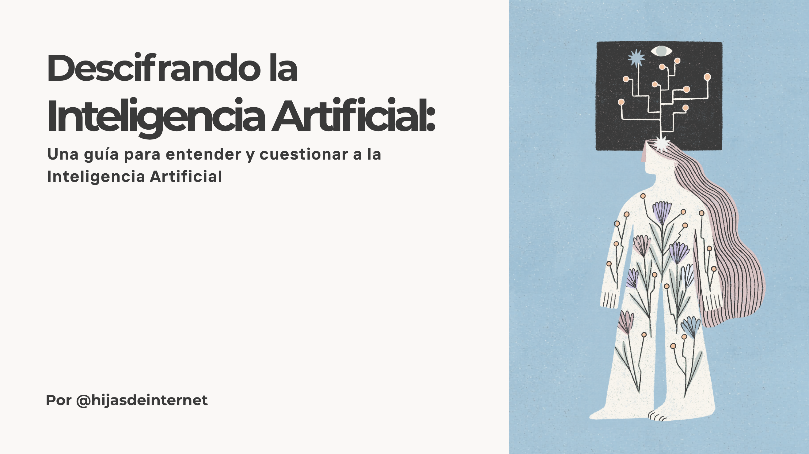

# Descifrando la IA

**Una guía para entender y cuestionar a la inteligencia artificial**

**Descifrando la IA** es un proyecto de [Hijas de Internet](https://instagram.com/hijasdeinternet) que busca acercar el conocimiento sobre qué son y cómo funcionan los modelos de inteligencia artificial que usamos todos los días, conocer sus alcances y sus limitaciones, y sus impactos socioambientales. Con esto, buscamos contribuir a la discusión sobre cómo pasar de ser usuarias pasivas a usuarias activas de herramientas de IA, siempre de una forma crítica y responsable que ponga al centro nuestras necesidades. 

A lo largo de esta wiki, podrás encontrar de forma general conceptos básicos sobre inteligencia artificial, herramientas para cuestionar sus sesgos e impactos ambientales, su papel en el futuro de trabajo y tips para usarlas de forma responsable. Además, si te gustaría seguir explorando estos temas, te compartimos referencias de distintas fuentes para que puedas consultar y seguir aprendiendo. 

## Módulos

La wiki se libera **módulo por módulo, junto con los episodios del podcast**. Los Módulos 1 y 2 ya están disponibles; los siguientes se publican conforme avanza la serie.

| #   | Tema                                                 | Estado          | Descripción                                                            |
| --- | ---------------------------------------------------- | --------------- | ---------------------------------------------------------------------- |
| 1   | **[Qué es la IA](01-que-es-la-ia.md)**               | Disponible      | Definiciones, cómo funcionan los modelos y conceptos clave             |
| 2   | **[Sesgos algorítmicos](02-sesgos-algoritmicos.md)** | Disponible      | Cómo los datos y algoritmos reproducen sesgos presentes en la sociedad |
| 3   | Impactos ambientales                            | Próximamente    | El costo material de entrenar modelos de IA                            |
| 4   | Futuro del trabajo                              | Próximamente    | Automatización, nuevos perfiles y el rol humano                        |
| 5   | Herramientas y uso responsable                  | Próximamente    | Cómo usar IA de forma crítica e informada                              |
|     | **[Cómo hicimos esta wiki](como-se-hizo.md)**   | Disponible      | Transparencia sobre el uso de IA en la producción de este proyecto     |

## ¿Para quién es esta guía?

Para cualquier persona curiosa sobre inteligencia artificial, especialmente:

- **Estudiantes universitarias** que quieren entender la IA más allá del hype
- **Profesionales** de cualquier disciplina que usan o usarán herramientas de IA
- **Personas interesadas** en tecnología, derechos digitales y pensamiento crítico

!!! tip "No necesitas saber programar"
    Esta guía está diseñada para ser accesible sin conocimientos previos de programación ni matemáticas avanzadas. Incluimos recursos para todos los niveles.

## Escucha el podcast

Este contenido acompaña la serie **Descifrando la IA** del podcast Hijas de Internet, disponible en todas las plataformas.

<iframe src="https://www.youtube.com/embed/rUiVXEvoIcw" frameBorder="0" allowfullscreen allow="autoplay; clipboard-write; encrypted-media; fullscreen; picture-in-picture" loading="lazy"></iframe>

## Equipo

**Hijas de Internet:** Luisa Alfaro, Monserrat López, Aranxa Bello Brindis, María Alfaro, Paloma Vázquez y Aranxa Márquez.

**Colaboradoras en el desarrollo de la wiki:** Monserrat López y Aranxa Márquez.

---

*Proyecto desarrollado en 2026 como parte del proyecto Descifrando la IA, de Hijas de Internet (última actualización abril 2026).*